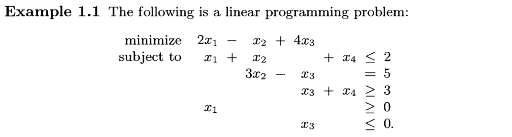
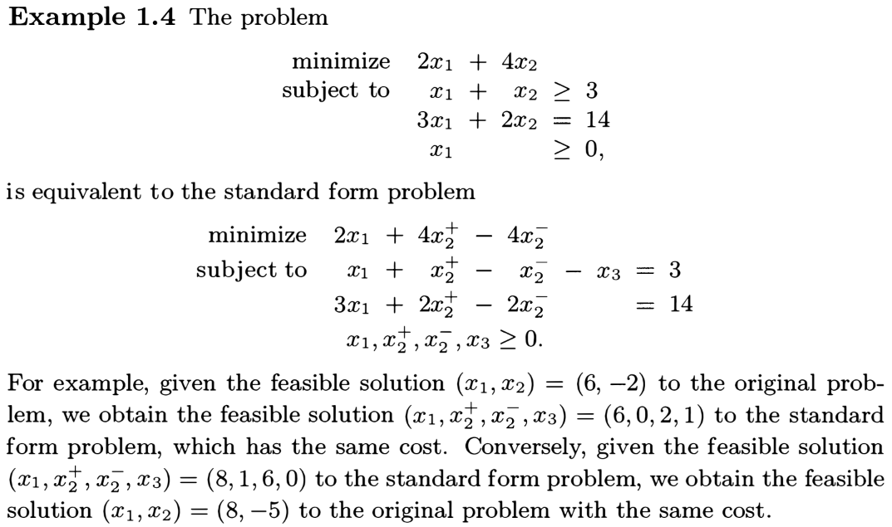

# Introduction to Linear Optimization

**Dimitris Bertsimas** (https://en.wikipedia.org/wiki/Dimitris_Bertsimas)

- Professor in the Sloan School of Management, MIT

**John N. Tsitsiklis** (https://en.wikipedia.org/wiki/John_Tsitsiklis)

- Professor of Electrical Engineering with the Department of EECS, MIT

**References**

- **Introduction to Linear Optimization** (1997)
  - Athena Scientific, Belmont, Massachusetts, ISBN 1-886529-19-1

## Chapter 1. Introduction

### 1.1 Variants of the linear programming problem

The  general **linear programming problem** is
$$
\begin{alignat*}{3}
\text{minimize} &\quad \mathbf{c}^T\mathbf{x}=\sum_{i=1}^n c_ix_i & \\
\text{subject to} &\quad \mathbf{a}_i^T\mathbf{x} \geq b_i, &\quad i\in M_1, \\
&\quad \mathbf{a}_i^T\mathbf{x} \leq b_i, &\quad i\in M_2, \\
&\quad \mathbf{a}_i^T\mathbf{x} = b_i, &\quad i\in M_3, \\
&\quad x_j \geq 0, &\quad j\in N_1, \\
&\quad x_j \leq 0, &\quad j\in N_2, \\
&\quad x_j \text{ free}, &\quad j\in N_3,
\end{alignat*}
$$

where $\{M_1,M_2,M_3\}$ is a partition of $\{1,\dotsc,m\}$ and $\{N_1,N_2,N_3\}$ is a partition of $\{1,\dotsc,n\}$. (Notice that the constraint $x_j=0$ has no effect on the object function.)

- **Cost vector**: $\mathbf{c}=(c_1,\dotsc,c_n)\in\mathbb{R}^n$

- **Decision variable**: $\mathbf{x}=(x_1,\dotsc,x_n)\in\mathbb{R}^n$

- **Feasible solution**: $\mathbf{x}\in\mathbb{R}^n$​ satisfying all of the constraints

- **Feasible set**: The set of all feasible solutions

- **Free (unrestricted) variable**: $x_j$ for $j\in N_3$, i.e., there is <u>no restriction</u> on $x_j$

- **Objective function**: $\mathbf{x}\in\mathbb{R}^n\mapsto\mathbf{c}^T\mathbf{x}=\sum_i c_ix_i\in\mathbb{R}$​

A feasible solution $\mathbf{x}^*$ that <u>minimizes</u> the objective function is called an **optimal (feasible) solution**.

- The value of $\mathbf{c}^T\mathbf{x}^*\in\mathbb{R}$ is called the **optimal cost**. 

- For any $K\in\mathbb{R}$, if we can find a feasible solution $\mathbf{x}$ such that $\mathbf{c}^T\mathbf{x}<K$, we say that the **optimal cost** is $-\infty$ or that the cost is **unbounded below**.

<figure style="text-align: left; padding-top: .5em; padding-bottom: .5em;">
  
</figure>

<u>No need to study maximization problems</u>: Maximizing $\mathbf{c}^T\mathbf{x}$ is equivalent to minimizing $-\mathbf{c}^T\mathbf{x}$​.

#### General form

A **linear programming problem in general form** is
$$
\begin{align*}
\text{minimize} & \quad\mathbf{c}^T\mathbf{x} \\
\text{subject to} & \quad\mathbf{Ax}\geq\mathbf{b},
\end{align*}
$$
where $\mathbf{b}=(b_1,\dotsc,b_m)\in\mathbb{R}^m$ and $\mathbf{A}$ is the $m\times n$ matrix whose rows are $\mathbf{a}_1^T,\dotsc,\mathbf{a}_m^T$.

1. An equality constraint $\mathbf{a}_i^T\mathbf{x}=b_i$ is equivalent to the two constraints $\mathbf{a}_i^T\mathbf{x}\geq b_i$ and $\mathbf{a}_i^T\mathbf{x}\leq b_i$.
2. Constraints of the form $\mathbf{a}_i^T\mathbf{x}\leq b_i$ can be rewritten as $(-\mathbf{a}_i)^T\mathbf{x}\geq -b_i$​.
3. Constraints of the form $x_j\geq0$ or $x_j\leq0$ are special cases of constraints of the form $\mathbf{a}_i^T\mathbf{x}\geq b_i$, where $\mathbf{a}_i=\pm\mathbb{1}_j=(0,\dotsc,\pm1,\dotsc,0)$ and $b_i=0$.

<figure style="text-align: left; padding-top: .5em; padding-bottom: .5em;">
  
</figure>

We say that two problems are **equivalent** if, given a <u>feasible solution to one problem</u>, we can construct a <u>feasible solution to the other, with the same cost</u>.

In particular, two equivalent problems have the same optimal cost, and given an optimal solution to one problem, we can construct an optimal solution to the other.

#### Standard form

A **linear programming problem in standard form** is
$$
\begin{align*}
\text{minimize} & \quad\mathbf{c}^T\mathbf{x} \\
\text{subject to} & \quad\mathbf{Ax}=\mathbf{b} \\
& \quad\mathbf{x}\geq\mathbf{0}
\end{align*}
$$
A general linear programming problem can be transformed into an <u>equivalent</u> problem in standard form.

1. Elimination of <u>free variables</u>: Any real number can be written as the difference of two nonnegative real numbers. Thus, we replace a free (unrestricted) variable $x_j$ by $x_j^+-x_j^-$, where $x_j^+$ and $x_j^-$ are new variables with the sign constraints $x_j^+\geq 0$ and $x_j^-\geq 0$.
2. Elimination of <u>inequality constraints</u>: An inequality constraint $\mathbf{a}_i^T \mathbf{x} \leq b_i$ is equivalent to the standard form $\mathbf{a}_i^T\mathbf{x}+s_i=b_i$ and $s_i\geq 0$. Such a (new) variable $s_i$ is called a **slack variable**. Similarly, $\mathbf{a}_i^T \mathbf{x} \geq b_i$ is equivalent to $\mathbf{a}_i^T\mathbf{x}-s_i=b_i$ and $s_i\geq 0$. In this case, $s_i$ is called a **surplus variable**.

<figure style="text-align: left; padding-top: .5em; padding-bottom: .5em;">
  
</figure>
