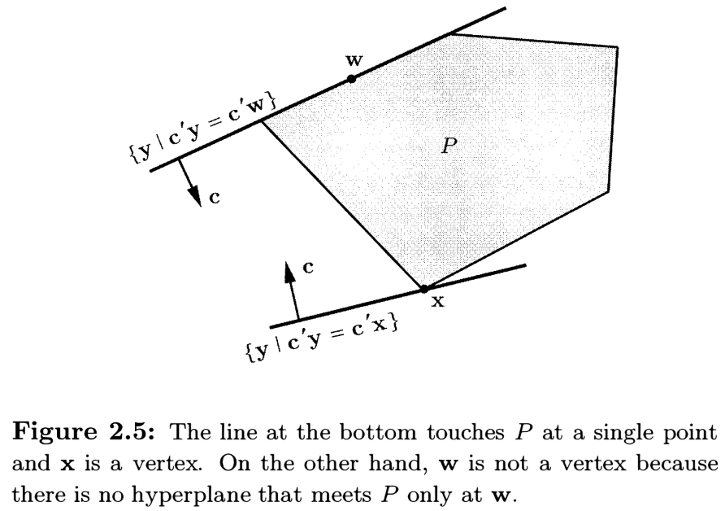
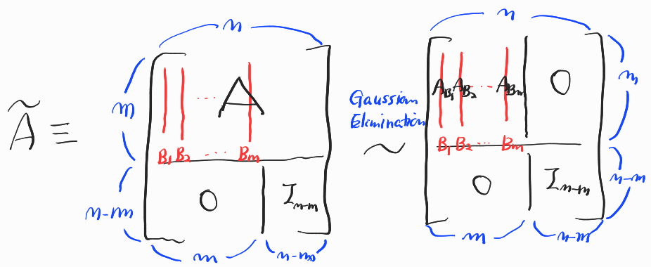
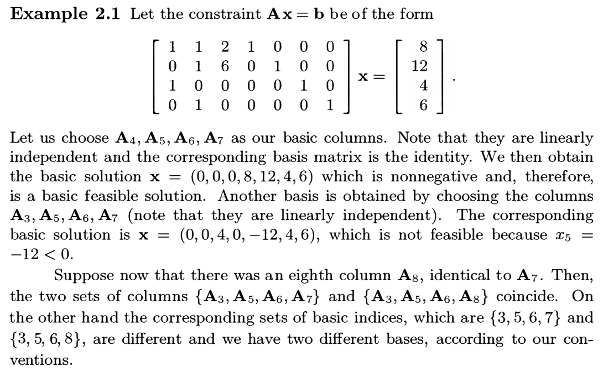
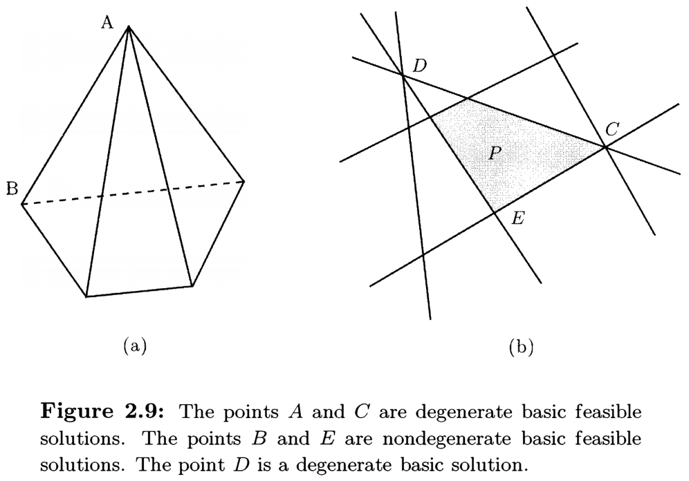
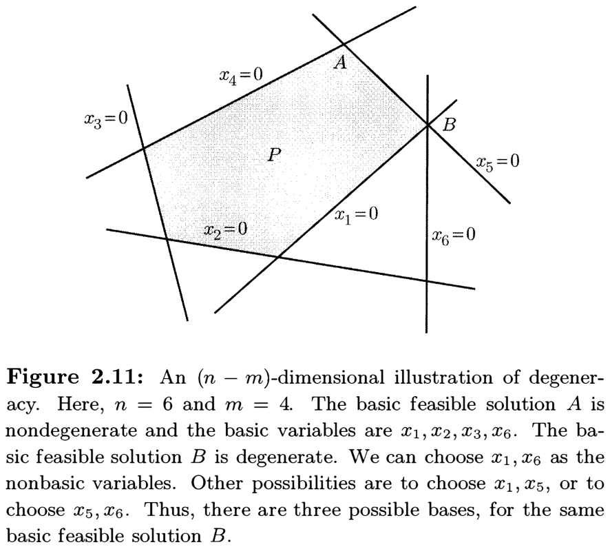

# Introduction to Linear Optimization

**Dimitris Bertsimas** (https://en.wikipedia.org/wiki/Dimitris_Bertsimas)

- Professor in the Sloan School of Management, MIT

**John N. Tsitsiklis** (https://en.wikipedia.org/wiki/John_Tsitsiklis)

- Professor of Electrical Engineering with the Department of EECS, MIT

**References**

- **Introduction to Linear Optimization** (1997)
  - Athena Scientific, Belmont, Massachusetts, ISBN 1-886529-19-1

## Chapter 2. The Geometry of Linear Programming

### 2.1 Polyhedra and convex sets

The <u>feasible set</u> of any linear programming problem is a <u>polyhedron</u>.

> __Definition 2.1__ Let $\mathbf{A}$ be an $m\times n$ matrix and $\mathbf{b}\in\mathbb{R}^m$.
>
> 1. A **polyhedron (in general form)** is a set $\{\mathbf{x}\in\mathbb{R}^n\mid \mathbf{Ax}\geq \mathbf{b}\}$.
> 2. A **polyhedron in standard form** is a set $\{\mathbf{x}\in\mathbb{R}^n\mid \mathbf{Ax}=\mathbf{b},\: \mathbf{x}\geq\mathbf{0}\}$.

> __Theorem 2.1__ (b) Every polyhedron is a <u>convex</u> set.
>
> _Proof._ A polyhedron is the intersection of a finite number of half-spaces $\{\mathbf{x}\in\mathbb{R}^n\mid\mathbf{a}_i^T\mathbf{x}\geq b_i\}$, and a half-space is convex.

### 2.2 Extreme points, vertices, and basic feasible solutions

We suggest three different ways of defining the <u>concept of a "corner"</u> and then show that all three definitions are equivalent.

#### Extreme point

Our first definition defines an *extreme point* of a polyhedron as <u>a point that cannot be expressed as a convex combination</u> of two other elements of the polyhedron; see Figure 2.4.

> __Definition 2.6__ Let $P$ be a polyhedron. A vector $\mathbf{x}\in P$ is an **extreme point** of $P$ if we cannot find two vectors $\mathbf{y},\mathbf{z}\in P$, both different from $\mathbf{x}$, and $\lambda\in[0,1]$ such that $\mathbf{x}=\lambda\mathbf{y}+(1-\lambda)\mathbf{z}$.

This definition is entirely <u>geometric</u> and does not refer to a specific representation of a polyhedron in terms of linear constraints.

#### Vertex

An alternative <u>geometric</u> definition defines a *vertex* of a polyhedron $P$ as <u>the unique optimal solution to some linear programming problem with feasible set</u> $P$.

> __Definition 2.7__ Let $P$ be a polyhedron. A vector $\mathbf{x}\in P$ is a **vertex** of $P$ if there exists some $\mathbf{c}\in\mathbb{R}^n$ such that $\mathbf{c}^T\mathbf{x}<\mathbf{c}^T\mathbf{y}$ for all $\mathbf{y}\neq\mathbf{x}\in P$.

In other words, $\mathbf{x}$ is a vertex of $P$ <u>if and only if</u> $P$ is on one side of a hyperplane $\{\mathbf{y}\in\mathbb{R}^n\mid\mathbf{c}^T\mathbf{y}=\mathbf{c}^T\mathbf{x}\}$ which meets $P$ only at $\mathbf{x}$; see Figure 2.5.

#### Basic feasible solution

The third definition <u>relies on a representation</u> of a polyhedron <u>in terms of linear constraints</u>.

Consider a polyhedron $P\subseteq\mathbb{R}^n$ defined in terms of the linear equality and inequality constraints
$$
\mathbf{a}_i^T\mathbf{x} \geq b_i, \quad \mathbf{a}_j^T\mathbf{x} \leq b_j, \quad \mathbf{a}_k^T\mathbf{x} = b_k,
$$
where $i\in M_1$, $j\in M_2$, and $k\in M_3$ are finite index sets.

> __Definition 2.8__ If a vector $\mathbf{x}^*$ satisfies $\mathbf{a}_i^T\mathbf{x}^*=b_i$ for some $i\in M_1$, $M_2$, or $M_3$, we say that the corresponding constraint is **active** (or **binding**) at $\mathbf{x}^*$.

We will often say that certain <u>constraints are linearly independent</u> if the corresponding vectors $\mathbf{a}_i$ are linearly independent.

If there are $n$ constraints that are active at $\mathbf{x}^*\in\mathbb{R}^n$, then $\mathbf{x}^*$ becomes a solution of a certain system of $n$ linear equations in $n$ unknowns:
$$
\begin{bmatrix} \vdots \\ \,\rule[.5ex]{2ex}{.1ex}\,\mathbf{a}_i^T\,\rule[.5ex]{2ex}{.1ex}\, \\ \vdots \end{bmatrix} \begin{bmatrix} \vdots \\ x_j \\ \vdots \end{bmatrix} = \begin{bmatrix} \vdots \\ b_i \\ \vdots \end{bmatrix}
$$
Notice that $\mathbf{x}^*$ is a <u>unique solution</u> if and only if the $n$ <u>active constraints are linearly independent</u>.

> __Definition 2.9__ Consider a polyhedron $P$ defined by linear equality and inequality constraints.
>
> - A vector $\mathbf{x}^*\in\mathbb{R}^n$ is a **basic solution** if
>
>   1. All <u>equality constraints are active</u> at $\mathbf{x}^*$;
>
>   2. There exist $n$ <u>linearly independent constraints that are active</u> at $\mathbf{x}^*$.
>
> - If $\mathbf{x}^*\in P$ is a basic solution, it is called a **basic feasible solution**.

In Figure 2.6, points $A$, $B$, and $C$ are <u>basic feasible solutions</u>. Point $D$ is <u>not a basic solution</u>. Point $E$ is <u>feasible, but not basic</u>.

Whether a point is a <u>basic solution</u> or not <u>may depend on</u> the way that a polyhedron is represented. In Figure 2.6, $D$ is not a basic solution, but $D$ is a basic solution of the same polyhedron with different representation: $\{\mathbf{x}\in\mathbb{R}^3\mid x_1+x_2+x_3\leq1,\,x_1+x_2+x_3\geq1,\,x_1\geq0,\,x_2\geq0,\,x_3\geq0\}$.

> __Theorem 2.3__ Let $P=\{\mathbf{x}\in\mathbb{R}^n\mid \mathbf{Ax}\geq \mathbf{b}\}$ be a <u>nonempty</u> polyhedron and let $\mathbf{x}^*\in P$. Then the following are equivalent:
>
> 1. $\mathbf{x}^*$ is a <u>vertex</u>;
> 2. $\mathbf{x}^*$ is an <u>extreme point</u>;
> 3. $\mathbf{x}^*$​ is a <u>basic feasible solution</u>.
>
> _Proof._ (1) $\Rightarrow$ (2) If $\mathbf{x}^*$ is <u>not an extreme point</u>, then there exist $\mathbf{y},\mathbf{z}\in P$ such that $\mathbf{y}\neq\mathbf{x}^*$, $\mathbf{z}\neq\mathbf{x}^*$, and $\mathbf{x}^*=\lambda\mathbf{y}+(1-\lambda)\mathbf{z}$ for some $0<\lambda<1$. Moreover, any $\mathbf{c}\in\mathbb{R}^n$ satisfying $\mathbf{c}^T\mathbf{x}^*<\mathbf{c}^T\mathbf{y}$ and $\mathbf{c}^T\mathbf{x}^*<\mathbf{c}^T\mathbf{z}$ gives a contradiction
>
> $$
> \mathbf{c}^T\mathbf{x}^* = \mathbf{c}^T(\lambda\mathbf{x}^*+(1-\lambda)\mathbf{x}^*) < \mathbf{c}^T(\lambda\mathbf{y}+(1-\lambda)\mathbf{z}) = \mathbf{c}^T\mathbf{x}^*.
> $$
> Therefore, $\mathbf{x}^*$​ is <u>not a vertex</u>.
>
> Let $I=\{i\mid\mathbf{a}_i^T\mathbf{x}^*=b_i\}$ be the set of indices of constraints that are active at $\mathbf{x}^*$.
>
> (2) $\Rightarrow$ (3) If $\mathbf{x}^*$ is <u>not a basic solution</u>, then the matrix having rows $\mathbf{a}_i$ for all $i\in I$ has rank less than $n$, and so it has a nonzero kernel $\mathbf{d}\in\mathbb{R}^n$ such that $\mathbf{a}_i^T\mathbf{d}=0$ for all $i\in I$. Consider $\mathbf{y}=\mathbf{x}^*+\epsilon\mathbf{d}$ and $\mathbf{z}=\mathbf{x}^*-\epsilon\mathbf{d}$ for $\epsilon>0$. Then $\mathbf{y}\neq\mathbf{x}^*$, $\mathbf{z}\neq\mathbf{x}^*$, and $\mathbf{x}^*=(\mathbf{y}+\mathbf{z})/2$.
>
> - For active constraints, we have $\mathbf{a}_i^T(\mathbf{x}^*\pm\epsilon\mathbf{d})=\mathbf{a}_i^T\mathbf{x}^*=b_i$ for all $i\in I$.
> - For non-active constraints, we have $\mathbf{a}_i^T\mathbf{x}^*>b_i$ for all $i\notin I$. Choose $\epsilon>0$ so that $\epsilon|\mathbf{a}_i^T\mathbf{d}|<\mathbf{a}_i^T\mathbf{x}^*-b_i$ for all $i\notin I$. Then $\mathbf{x}^*\pm\epsilon\mathbf{d}\in P$, since for all $i\notin I$,
>
> $$
> \mathbf{a}_i^T(\mathbf{x}^*\pm\epsilon\mathbf{d})-b_i = (\mathbf{a}_i^T\mathbf{x}^*-b_i)\pm\epsilon\mathbf{a}_i^T\mathbf{d} \geq (\mathbf{a}_i^T\mathbf{x}^*-b_i)-\epsilon|\mathbf{a}_i^T\mathbf{d}| > 0.
> $$
> Therefore, $\mathbf{x}^*$ is <u>not an extreme point</u>.
>
> (3) $\Rightarrow$ (1) Let $\mathbf{x}^*$ be a <u>basic feasible solution</u> and set $\mathbf{c}=\sum_{i\in I}\mathbf{a}_i$. Notice that $I\neq\varnothing$.
>
> For any $\mathbf{y}\in P$, we have $\mathbf{Ay}\geq\mathbf{b}$ so that $\mathbf{a}_i^T\mathbf{y}\geq b_i$ for all $i$. It follows that $\mathbf{x}^*=\min_{\mathbf{y}\in P}\mathbf{c}^T\mathbf{y}$, since
> $$
> \mathbf{c}^T\mathbf{y}=\sum_{i\in I}\mathbf{a}_i^T\mathbf{y}\geq\sum_{i\in I}b_i=\sum_{i\in I}\mathbf{a}_i^T\mathbf{x}^*=\mathbf{c}^T\mathbf{x}^*.
> $$
> We claim that $\mathbf{c}^T\mathbf{y}=\mathbf{c}^T\mathbf{x}^*$ implies $\mathbf{y}=\mathbf{x}^*$ for any $\mathbf{y}\in P$. Then $\mathbf{x}^*$ is a <u>vertex</u> of $P$.
>
> Suppose $\mathbf{c}^T\mathbf{y}=\sum_{i\in I}\mathbf{a}_i^T\mathbf{y}=\sum_{i\in I}b_i=\mathbf{c}^T\mathbf{x}^*$. Since $\mathbf{a}_i^T\mathbf{y}\geq b_i$, we must have $\mathbf{a}_i^T\mathbf{y}=b_i$ for all $i\in I$. By assumption, $\mathbf{x}^*$ is a basic solution so that $\mathbf{x}^*$ is a <u>unique solution</u> to the system of equations $\mathbf{a}_i^T\mathbf{x}=b_i$ for all active constraints, $i\in I$. Therefore $\mathbf{y}=\mathbf{x}^*$.

Note that the property of <u>being a basic *feasible* solution</u> (algebraic) is independent of the representation of a polyhedron, since the definitions of "vertex" and "extreme point" are <u>geometric</u>. 

> __Corollary 2.1__ Given a finite number of linear inequality constraints, there can only be a <u>finite number</u> of basic or basic feasible solutions.
>
> _Proof._ Different basic solutions correspond to different sets of $n$ linearly independent active constraints.

#### Adjacent basic solution

Two <u>distinct basic solutions</u> in $\mathbb{R}^n$ are said to be **adjacent** if we can find $n-1$ linearly independent constraints that are active at both of them. In Figure 2.7, $D$ and $E$ are adjacent to $B$; also, $A$ and $C$ are adjacent to $D$​​.

If two adjacent basic solutions are also feasible, then the line segment that joins them is called an **edge** of the feasible set.

### 2.3 Polyhedra in standard form

Let $P=\{\mathbf{x}\in\mathbb{R}^n\mid\mathbf{Ax}=\mathbf{b},\,\mathbf{x}\geq\mathbf{0}\}$ be a <u>polyhedron in standard form</u>, where $\mathbf{A}$ is an $m\times n$ matrix with <u>linearly independent</u> rows. (It requires that $m=\operatorname{rank} A\leq n$.)

- In standard form, there are $m+n$ <u>candidates for active constraint</u>; $m$ constraints $\mathbf{a}_i^T\mathbf{x}=b_i$ for $1\leq i\leq m$ from $\mathbf{Ax}=\mathbf{b}$ and the other $n$ constraints $\mathbb{1}_j^T\mathbf{x}=x_j=0$ for $1\leq j\leq n$ from $\mathbf{x}\geq\mathbf{0}$, where $\mathbb{1}_j\in\mathbb{R}^n$ is the unit vector such that all entries are zero except for one at the index $j$.
- If $\mathbf{x}$ is a <u>basic solution</u>, we have (1) $m$ (linearly independent) active constraints from $\mathbf{Ax}=\mathbf{b}$, and (2) $n$ linearly independent active constraints which <u>may not contain</u> all of the $m$ active constraints $\mathbf{a}_i^T\mathbf{x}=b_i$.
- However, it is always possible to find another $n$ linearly independent active constraints <u>containing all</u> of the $m$ active constraints $\mathbf{a}_i^T\mathbf{x}=b_i$, since the rows $\{\mathbf{a}_i\mid 1\leq i\leq m\}$ of $\mathbf{A}$​ are <u>linearly independent</u>.
- In this case, we have an $n\times n$ <u>non-singular active constraint matrix</u> $\mathbf{\tilde A}$ with $m$ rows $\mathbf{a}_i^T$ for $1\leq i\leq m$, and $n-m$ rows of the form $\mathbb{1}_j^T$ for $j\in J\subseteq\{1,\dotsc,n\}$ such that $|J|=n-m$​.

> __Theorem 2.4__ Let $P=\{\mathbf{x}\in\mathbb{R}^n\mid\mathbf{Ax}=\mathbf{b},\,\mathbf{x}\geq\mathbf{0}\}$ be a polyhedron in standard form, where $\mathbf{A}$ is an $m\times n$ matrix with linearly independent rows. A vector $\mathbf{x}\in\mathbb{R}^n$ is a basic solution of $P$ <u>if and only if</u> $\mathbf{Ax}=\mathbf{b}$, and there exist indices $B_1,\dotsc,B_m$ such that
>
> 1. The columns $\mathbf{A}_{B_1},\dotsc,\mathbf{A}_{B_m}$ are linearly independent;
> 2. If $j\in J=\{B_1,\dotsc,B_m\}^C$, then $x_j=0$.
>
> _Proof._ ($\Leftarrow$) We have $m$ active constraints $\mathbf{a}_i^T\mathbf{x}=b_i$ for $1\leq i\leq m$ from $\mathbf{Ax}=\mathbf{b}$ and the other $n-m$ active constraints $\{x_j=0\mid j\in J\}$. It remains to show that these $n$ constraints are <u>linearly independent</u>. Suppose that $\mathbf{a}_i^T\mathbf{y}=0$ for $1\leq i\leq m$ and $y_j=0$ for all $j\in J$. Since the columns $\mathbf{A}_{B_1},\dotsc,\mathbf{A}_{B_m}$ are linearly independent, we have
> $$
> \mathbf{0} = \mathbf{Ay} = \sum_{k=1}^m\mathbf{A}_{B_k}y_{B_k} \implies y_{B_k}=0\text{ for }1\leq k\leq m \implies \mathbf{y}=0.
> $$
> ($\Rightarrow$) We may assume that there are $n$ linearly independent active constraints; $m$ constraints $\mathbf{a}_i^T\mathbf{x}=b_i$ for $1\leq i\leq m$ from $\mathbf{Ax}=\mathbf{b}$, and $n-m$ constraints $x_j=0$ for $j\in J\subseteq\{1,\dotsc,n\}$. Since $|J|=n-m$, we can choose the other $m$ indices, $B_1,\dotsc,B_m\notin J$.
>
> (2) follows immediately, and (1) follows from the fact that $\mathbf{\tilde A}$​ is non-singular.
>

> __Procedure for constructing basic solutions__
>
> 1. Choose $m$ linearly independent columns $\mathbf{A}_{B_1},\dotsc,\mathbf{A}_{B_m}$.
> 2. Let $x_j=0$ for all $j\notin\{B_1,\dotsc,B_m\}$.
> 3. Solve the system of $m$ equations $\mathbf{Ax}=\mathbf{b}$ for the unknowns $x_{B_1},\dotsc,x_{B_m}$.
>
> If a basic solution constructed according to this procedure is <u>nonnegative</u>, then it is feasible, and it is a <u>basic feasible solution</u>.

If $\mathbf{x}$ is a basic solution, the variables $x_{B_1},\dotsc,x_{B_m}$ are called **basic variables**; the remaining variables are called **nonbasic**. The columns $\mathbf{A}_{B_1},\dotsc,\mathbf{A}_{B_m}$ are called the **basic columns**, and they form a **basis** of $\mathbf{R}^m$.

By arranging the $m$ basic columns next to each other, we obtain an $m\times m$ matrix $\mathbf{B}$, called a **basis matrix**. We can similarly define a vector $\mathbf{x}_B$ with the values of the basic variables.
$$
\mathbf{B} = \begin{bmatrix} \vline & \vline & & \vline \\ \mathbf{A}_{B_1} & \mathbf{A}_{B_2} & \dotsb & \mathbf{A}_{B_m} \\ \vline & \vline & & \vline \end{bmatrix},
\quad \mathbf{x}_B = \begin{bmatrix} x_{B_1} \\ \vdots \\ x_{B_m} \end{bmatrix}.
$$
The basic variables are determined by solving the equation $\mathbf{B}\mathbf{x}_B=\mathbf{b}$ whose <u>unique solution</u> is given by $\mathbf{x}_B=\mathbf{B}^{-1}\mathbf{b}$​.

<figure style="text-align: left; padding-top: .5em; padding-bottom: .5em;">
  
</figure>

#### Correspondence of bases and basic solutions

Different basic solutions must correspond to different bases, because a basis <u>uniquely determines</u> a basic solution, i.e., {bases} $\to$ {basic solutions} is a map. However, two different bases may lead to the same basic solution, i.e., the map is not one-to-one.

#### The full row rank assumption on $\mathbf{A}$

> __Theorem 2.5__ Let $P=\{\mathbf{x}\in\mathbb{R}^n\mid\mathbf{Ax}=\mathbf{b},\,\mathbf{x}\geq\mathbf{0}\}$ be a <u>nonempty</u> polyhedron, where $\mathbf{A}$ is an $m\times n$ matrix. Suppose that $\operatorname{rank}A=k<m$ and that the rows $\mathbf{a}_{i_1}^T,\dotsc,\mathbf{a}_{i_k}^T$ are linearly independent. Then
> $$
> P = Q = \{\mathbf{x}\in\mathbb{R}^n\mid \mathbf{a}_{i_1}^T\mathbf{x}=b_{i_1},\dotsc,\mathbf{a}_{i_k}^T\mathbf{x}=b_{i_k}\,\mathbf{x}\geq\mathbf{0}\}.
> $$
> _Proof._ ($\subseteq$) is trivial. ($\supseteq$) Since any row $\mathbf{a}_i^T$ of $\mathbf{A}$ can be expressed in a linear combination of $\mathbf{a}_{i_1}^T,\dotsc,\mathbf{a}_{i_k}^T$ and $\mathbf{x}\in P\neq\varnothing$, we have
> $$
> b_i = \mathbf{a}_i^T\mathbf{x} = \sum_{j=1}^k \lambda_{ii_j}\mathbf{a}_{i_j}^T\mathbf{x} = \sum_{j=1}^k \lambda_{ii_j}b_{i_j}.
> $$
> Thus $\mathbf{y}\in Q$, i.e., $\mathbf{a}_{i_j}^T\mathbf{y}=b_{i_j}$ for all $1\leq j\leq k$ implies $\mathbf{a}_i^T\mathbf{y}=b_i$ for all $1\leq i\leq m$, i.e., $\mathbf{y}\in P$.

As long as the feasible set is nonempty, <u>a linear programming problem in standard form can be reduced to an equivalent standard form problem</u> (with the same feasible set) <u>in which the equality constraints are linearly independent</u>.

### 2.4 Degeneracy

> __Definition 2.10__ A <u>basic solution</u> $\mathbf{x}\in\mathbb{R}^n$ is said to be **degenerate** if more than $n$ of the constraints are active at $\mathbf{x}$.

<figure style="text-align: left; padding-top: .5em; padding-bottom: .5em;">
  
</figure>

#### Degeneracy in standard form polyhedra

> __Definition 2.11__ Let $P=\{\mathbf{x}\in\mathbb{R}^n\mid\mathbf{Ax}=\mathbf{b},\,\mathbf{x}\geq\mathbf{0}\}$ be a polyhedron in standard form where $\mathbf{A}$ is an $m\times n$ matrix. A <u>basic solution</u> $\mathbf{x}$ is called **degenerate** if more than $n-m$ of the components of $\mathbf{x}$ are zero.

<figure style="text-align: left; padding-top: .5em; padding-bottom: .5em;">
  
</figure>

#### Degeneracy is not a purely geometric property

A <u>degenerate basic feasible solution</u> under one representation <u>could be nondegenerate</u> under another representation.

The vector $(0,0,1)$ is a degenerate basic feasible solution in the <u>standard form</u> polyhedron
$$
P = \bigl\{(x_1,x_2,x_3)\mid x_1-x_2=0,\,x_1+x_2+2x_3=2,\,x_1,x_2,x_3\geq0 \bigr\},
$$
but it is not degenerate in the (<u>non-standard form</u>) polyhedron
$$
P = \bigl\{ (x_1,x_2,x_3)\mid x_1-x_2=0,\,x_1+x_2+2x_3=2,\,x_1\geq0,\,x_3\geq0 \bigr\}.
$$
However, if a basic feasible solution is <u>degenerate</u> under one particular <u>standard form</u> representation, then it is <u>degenerate</u> under every <u>standard form</u> representation of the same polyhedron.

### 2.5 Existence of extreme points

> __Definition 2.12__ A polyhedron $P=\{\mathbf{x}\in\mathbb{R}^n\mid\mathbf{Ax}\geq\mathbf{b}\}$ **contains a line** if there exist $\mathbf{x}\in P$ and $\mathbf{d}\neq\mathbf{0}\in\mathbb{R}^n$ such that $\mathbf{x}+\lambda\mathbf{d}\in P$ for all $\lambda\in\mathbb{R}$​.

If $P$ contains a line $\mathbf{x}+\lambda\mathbf{d}$, then $\mathbf{a}_i^T(\mathbf{x}+\lambda\mathbf{d})\geq b_i$ for all $1\leq i\leq m$ and for all $\lambda\in\mathbb{R}$. It follows that $\mathbf{a}_i^T\mathbf{d}=0$, i.e., $\mathbf{d}\in\operatorname{ker}A\neq\{\mathbf{0}\}$.

($\because$) If $\mathbf{a}_i^T\mathbf{d}>0$ (or $\mathbf{a}_i^T\mathbf{d}<0$), we can pick $\lambda\to-\infty$ (or $\infty$​) to violate the constraint.

On the other hand, if nonzero $\mathbf{d}\in\operatorname{ker}A\neq\{\mathbf{0}\}$, then $P$ contains a line $\mathbf{x}+\lambda\mathbf{d}$, since $\mathbf{a}_i^T(\mathbf{x}+\lambda\mathbf{d})=\mathbf{a}_i^T\mathbf{x} \geq b_i$ for all $1\leq i\leq m$ and for all $\lambda\in\mathbb{R}$.

> __Theorem 2.6__ Let $P=\{\mathbf{x}\in\mathbb{R}^n\mid\mathbf{Ax}\geq\mathbf{b}\}$ be a <u>nonempty</u> polyhedron, where $\mathbf{A}$ is an $m\times n$ matrix. Then the following are equivalent:
>
> 1. $P$ has at least one extreme point, or one basic feasible solution.
> 2. $P$ does not contain a line, or $\ker A=\{\mathbf{0}\}$.
> 
>_Proof._ (1) $\Rightarrow$ (2) If $P$ has a basic feasible solution $\mathbf{x}$, then there exist $n$ linearly independent constraints that are active at $\mathbf{x}$; in other words $\operatorname{rank}A=n$ or $\operatorname{ker}A=\{\mathbf{0}\}$.
> 
> (2) $\Rightarrow$ (1) Choose $\mathbf{x}\in P\neq\varnothing$ and let $I=\{i\mid\mathbf{a}_i^T\mathbf{x}=b_i\}$ be the set of indices of active constraints. If the rank of $\{\mathbf{a}_i\mid i\in I\}=n$, then $\mathbf{x}$ is a basic feasible solution and done. Otherwise, there exists $\mathbf{d}\neq\mathbf{0}\in\mathbb{R}^n$ such that $\mathbf{a}_i^T\mathbf{d}=0$ for all $i\in I$.
> 
> For $i\in I$, we have $\mathbf{a}_i^T\mathbf{x}=b_i$ and $\mathbf{a}_i^T\mathbf{d}=0$ so that $\mathbf{a}_i^T(\mathbf{x}+\lambda\mathbf{d})=b_i$ for all $\lambda\in\mathbb{R}$​. Notice that $\mathbf{x}+\lambda\mathbf{d}\in P$ for sufficiently small $|\lambda|$, since
> $$
>\{\mathbf{y}\in\mathbb{R}^n\mid\mathbf{a}_k^T\mathbf{y}>b_k\text{ for all $k\notin I$ and }\mathbf{a}_i^T\mathbf{y}=b_i\text{ for all $i\in I$}\}
> $$
> is open in $P\cap\{\mathbf{y}\in\mathbb{R}^n\mid\mathbf{a}_i^T\mathbf{y}=b_i\text{ for all $i\in I$}\}$.
> 
> By assumption, $P$ does not contain a line so that as we vary $\lambda$, some constraint will be eventually violated. In other words, there exists $\lambda^*\in\mathbb{R}$ and $k\notin I$ such that $\mathbf{a}_k^T(\mathbf{x}+\lambda^*\mathbf{d})=b_k$. Moreover, $\mathbf{a}_k$ is not a linear combination of $\{\mathbf{a}_i\mid i\in I\}$. ($\because$) Since $\mathbf{a}_i^T\mathbf{d}=0$ for all $i\in I$, any linear combination of $\{\mathbf{a}_i\mid i\in I\}$ is orthogonal to $\mathbf{d}$. But $\mathbf{a}_k^T\mathbf{x}>b_k$.
> 
>Thus, by moving from $\mathbf{x}$ to $\mathbf{x}+\lambda^*\mathbf{d}$, the number of linear independent active constraints has been increased by at least one. By repeating the same argument, as many times as needed, we eventually end up with a point at which there are $n$ linearly independent active constraints. (See Figure 2.14.)
> 
>

> __Corollary 2.2__ Every nonempty <u>bounded</u> polyhedron and every nonempty polyhedron in <u>standard form</u> has at least one basic feasible solution. 

### 2.6 Optimality of extreme points

> __Theorem 2.7__ Let $P=\{\mathbf{x}\in\mathbb{R}^n\mid \mathbf{Ax}\geq\mathbf{b}\}$ be a polyhedron having <u>at least one extreme point</u>. If a linear programming problem over $P$ has an <u>optimal solution</u>, then it also has an <u>extreme point which is optimal</u>.
>
> _Proof._ Let $Q=\{\mathbf{x}\in\mathbb{R}^n\mid \mathbf{Ax}\geq\mathbf{b},\,\mathbf{c}^T\mathbf{x}=v\}\neq\varnothing$ be the set of all optimal solutions, where $v$ is the optimal value. Then $Q\subseteq P$ is also a polyhedron having at least one extreme point. ($\because$) $P$ has an extreme point $\Rightarrow$ $P$ does not have a line $\Rightarrow$ $Q$ does not have a line $\Rightarrow$ $Q$ has an extreme point.
>
> We claim that an extreme point $\mathbf{x}^*$ of $Q$ is also an extreme point of $P$. If not, there exist $\mathbf{y},\mathbf{z}\in P$ such that $\mathbf{y}\neq\mathbf{x}$, $\mathbf{z}\neq\mathbf{x}$, and $\mathbf{x}^*=\lambda\mathbf{y}+(1-\lambda)\mathbf{z}$ for some $\lambda\in[0,1]$. Since $\mathbf{c}^T\mathbf{y}\geq v$ and $\mathbf{c}^T\mathbf{z}\geq v$,
> $$
> \begin{align*}
> & v=\mathbf{c}^T\mathbf{x}^*=\lambda\mathbf{c}^T\mathbf{y}+(1-\lambda)\mathbf{c}^T\mathbf{z}\geq\lambda v+(1-\lambda)v=v \\
> &\quad\implies \mathbf{c}^T\mathbf{y}=\mathbf{c}^T\mathbf{z}=v
> \implies \mathbf{y},\mathbf{z}\in Q
> \end{align*}
> $$
> which contradicts to that $\mathbf{x}^*$ is an extreme point of $Q$​.

Theorem 2.7 applies to a polyhedron in standard form, as well as to a bounded polyhedron, since it has at least one extreme point by Corollary 2.2.

> __Theorem 2.8__ Let $P=\{\mathbf{x}\in\mathbb{R}^n\mid \mathbf{Ax}\geq\mathbf{b}\}$ be a polyhedron having <u>at least one extreme point</u>. A linear programming problem over $P$ has either <u>the optimal cost</u> $-\infty$​ or an <u>extreme point which is optimal</u>.

Theorem 2.7의 증명에서 extreme point를 찾을 때 objective function $\mathbf{c}^T\mathbf{x}$를 줄이는 방향으로 $\mathbf{d}$를 선택할 수 있다. 즉, $\mathbf{c}^T\mathbf{d}\leq 0$. 이 경우, 반직선 $\mathbf{x}+\lambda\mathbf{d}$ for $\lambda\geq0$에 대해 $\mathbf{c}^T(\mathbf{x}+\lambda\mathbf{d})\leq\mathbf{c}^T\mathbf{x}$​​이 성립한다.

- If $\mathbf{c}^T\mathbf{d}=0$, then $\mathbf{c}^T(\mathbf{x}+\lambda\mathbf{d})=\mathbf{c}^T\mathbf{x}$ for all $\lambda\in\mathbb{R}$. 가정에 의해 직선이 모두 $P$에 들어갈 수는 없다.

- If $\mathbf{c}^T\mathbf{d}<0$, then $\mathbf{c}^T(\mathbf{x}+\lambda\mathbf{d})\to-\infty$ as $\lambda\to\infty$. 이 경우, 반직선이 모두 $P$에 들어가면 optimal cost는 $-\infty$가 된다.

그렇지 않다면 $\mathbf{a}_k^T(\mathbf{x}+\lambda^*\mathbf{d})=b_k$가 되는 $\lambda^*\geq 0$와 $k\notin I$가 존재하게 된다. 즉, $\mathbf{c}^T(\mathbf{x}+\lambda^*\mathbf{d})\leq\mathbf{c}^T\mathbf{x}$.

For a general linear programming problem, if the feasible set $P$ has no extreme point, then Theorem 2.8 does not apply directly. On the other hand, any linear programming problem can be transformed into an equivalent problem in standard form to which Theorem 2.8 does apply.

> __Corollary 2.3__ A linear programming problem over a <u>nonempty</u> polyhedron has either the optimal cost $-\infty$​ or an optimal solution.

In the <u>nonlinear</u> problem of minimizing $1/x$ subject to $x\geq 1$, the optimal cost is not $-\infty$, but an optimal solution does not exist.

### 2.9 Summary

Let $P=\{\mathbf{x}\in\mathbb{R}^n\mid \mathbf{Ax}\geq\mathbf{b}\}$ be a nonempty feasible set (polyhedron).

- If​ $P$ is <u>bounded</u>, there exists an optimal solution. ($\because$ $P$ is compact so that the image of the object function is also compact.) Furthermore, there exists an <u>optimal solution which is an extreme point</u>. (Corollary 2.2 and Theorem 2.8)
- If $P$ is <u>unbounded</u>, there are the following possibilities:
   1. There exists an <u>optimal solution which is an extreme point</u>.
      - This can only happen when $P$ has <u>at least one extreme point</u>. For example, $P=\{(x_1,x_2)\in\mathbb{R}^2\mid x_1\geq0,\,x_2\geq0\}$ and $\mathbf{c}=(1,1)$​​.
   2. There exists an <u>optimal solution</u>, but <u>no optimal solution is an extreme point</u>.
      - This can only happen when $P$ has <u>no extreme points</u>; it never happens when the problem is in standard form. For example, $P=\{(x_1,x_2)\in\mathbb{R}^2\mid x_2\geq0\}$ and $\mathbf{c}=(0,1)$. It is equivalent to the standard form $P=\{(x_1^+,x_1^-,x_2)\in\mathbb{R}^3\mid x_1^+,x_1^-,x_2\geq0\}$ and $\mathbf{c}=(0,0,1)$.
   3. The optimal cost is $-\infty$. For example,
      - (with extreme point) $P=\{(x_1,x_2)\in\mathbb{R}^2\mid x_1\geq0,\,x_2\geq0\}$ and $\mathbf{c}=(-1,-1)$.
      - (no extreme point) $P=\{(x_1,x_2)\in\mathbb{R}^2\mid x_2\geq0\}$ and $\mathbf{c}=(0,-1)$.

The distinction between geometric properties of a polyhedron and those properties that depend on a particular representation.

- Whether or not a point is an <u>extreme point</u> (or <u>basic feasible solution</u>) is a <u>geometric</u> property.
- Whether or not a point is a <u>basic solution</u> may <u>depend on</u> the way that a polyhedron is represented.
- Whether or not a basic or basic feasible solution is <u>degenerate</u> may <u>depend on</u> the way that a polyhedron is represented.

