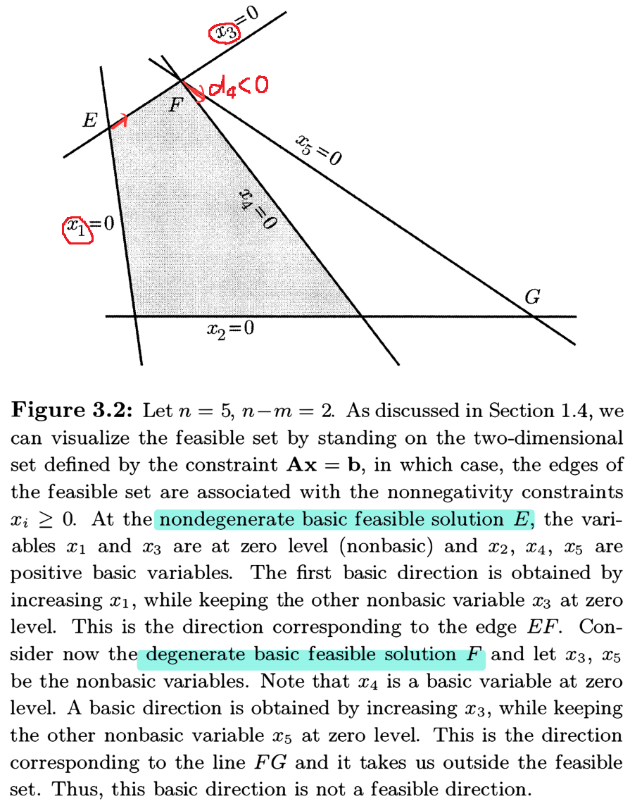
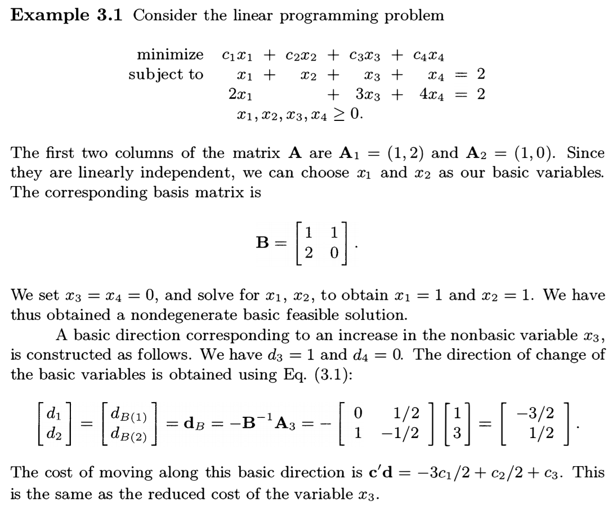
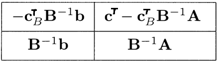
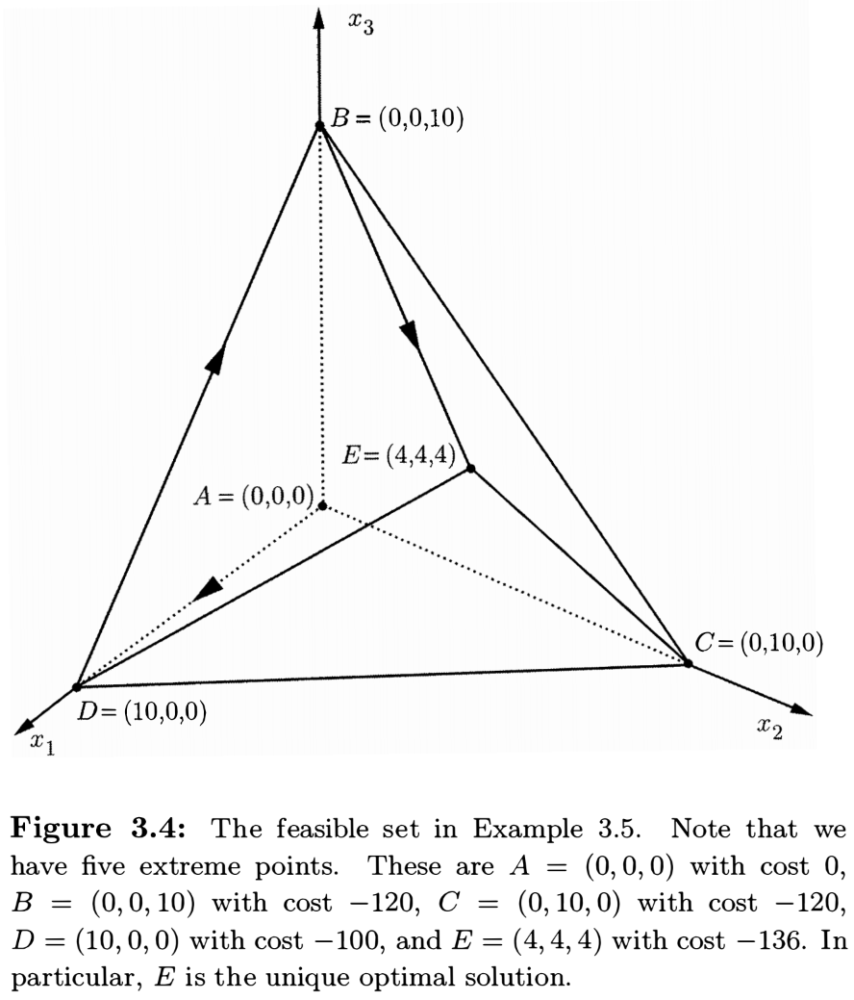
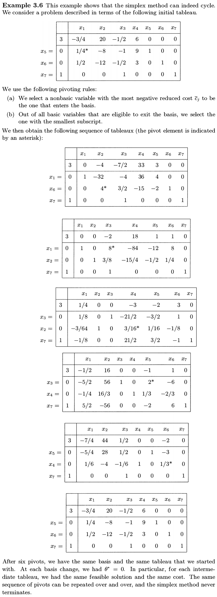
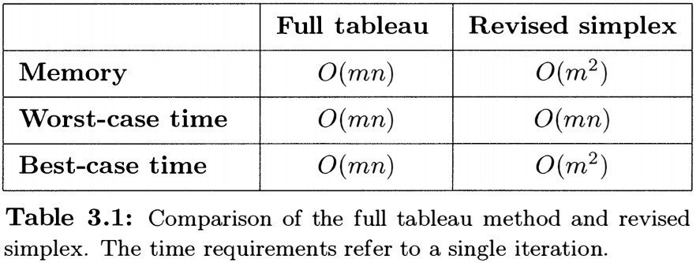
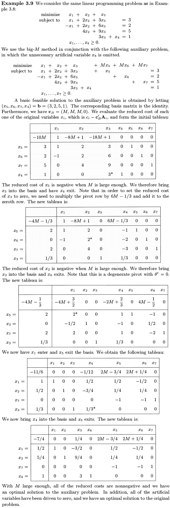
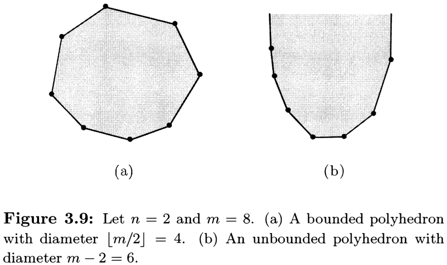

# Introduction to Linear Optimization

**Dimitris Bertsimas** (https://en.wikipedia.org/wiki/Dimitris_Bertsimas)

- Professor in the Sloan School of Management, MIT

**John N. Tsitsiklis** (https://en.wikipedia.org/wiki/John_Tsitsiklis)

- Professor of Electrical Engineering with the Department of EECS, MIT

**References**

- **Introduction to Linear Optimization** (1997)
  - Athena Scientific, Belmont, Massachusetts, ISBN 1-886529-19-1

## Chapter 3. The Simplex Method

The simplex method is based on the fact that

> If a linear programming problem in <u>standard form</u> has an optimal solution, then there exists a <u>basic feasible solution that is optimal</u>.

and <u>searches for an optimal solution</u> by moving from <u>one basic feasible solution to another</u>, along the edges of the feasible set, always in a <u>cost reducing direction</u>. Eventually, a basic feasible solution is reached at which none of the available edges leads to a cost reduction; such a basic feasible solution is optimal and the algorithm terminates.

Let $P=\{\mathbf{x}\in\mathbb{R}^n\mid\mathbf{Ax}=\mathbf{b},\,\mathbf{x}\geq\mathbf{0}\}$ be a <u>feasible set in standard form</u>, where $\mathbf{A}$ is an $m\times n$ matrix such that its $m$ rows are <u>linearly independent</u>. 

### 3.1 Optimality conditions

In linear programming, <u>local optimality implies global optimality</u>; this is because we are minimizing a convex function over a convex set.

We concentrate on the problem of <u>searching for a direction of cost decrease in a neighborhood of a given basic feasible solution</u>, and on the associated optimality conditions.

__Definition 3.1__ A vector $\mathbf{d}\neq\mathbf{0}\in\mathbb{R}^n$ is called a **feasible direction** at $\mathbf{x}\in P$, if there exists $\theta>0$ such that $\mathbf{x}+\theta\mathbf{d}\in P$.

Let $\mathbf{x}$ be a <u>basic feasible solution</u>. Denote by $B=\{B_1,\dotsc B_m\}$ the set of indices of the basic variables, and by $N$ the set of indices of nonbasic variables.

By Theorem 2.4, $x_i=0$ for <u>nonbasic</u> variables $i\in N$, while $\mathbf{x}_B\in\mathbb{R}^m$ of <u>basic</u> variables is given by
$$
\mathbf{x}_B = (x_{B_1},\dotsc,x_{B_m}) = \mathbf{B}^{-1}\mathbf{b},
$$
where $\mathbf{B}=\begin{bmatrix}\mathbf{A}_{B_1}&\dotsb&\mathbf{A}_{B_m}\end{bmatrix}$ is the corresponding (nonsingular) $m\times m$ <u>basis</u> matrix.

Choose a <u>nonbasic</u> index $j\in N$. Let $\mathbf{d}\in\mathbb{R}^n$ with $d_j=1$ and $d_i=0$ for $i\neq j\in N$. If $\mathbf{d}$ is a <u>feasible direction</u>, then $\mathbf{x}+\theta\mathbf{d}\in P$ for some $\theta>0$. Since $\mathbf{x}\in P$, it follows that $\mathbf{Ad}=\mathbf{0}$ and

$$
\mathbf{Ad} = \sum_i\mathbf{A}_id_i = \sum_{k=1}^m\mathbf{A}_{B_k}d_{B_k}+\mathbf{A}_j = \mathbf{B}\mathbf{d}_B+\mathbf{A}_j.
$$
Thus $\mathbf{d}_B=(d_{B_1},\dotsc,d_{B_m})=-\mathbf{B}^{-1}\mathbf{A}_j\in\mathbb{R}^m$.

#### Basic directions and feasible directions

Let $\mathbf{x}$ be a <u>basic feasible solution</u>. For a <u>nonbasic</u> index $j\in N$, the $j$-th **basic direction** is defined by the nonzero vector $\mathbf{d}\in\mathbb{R}^n$ with $\mathbf{d}_B=-\mathbf{B}^{-1}\mathbf{A}_j$, and $d_j=1$ but $d_i=0$ for $i\neq j\in N$​.

Is the $j$-th <u>basic direction</u> always a <u>feasible direction</u>?

- The equality constraints $\mathbf{A}(\mathbf{x}+\theta\mathbf{d})=\mathbf{b}$ hold for all $\theta\in\mathbb{R}$, since $\mathbf{Ad}=\mathbf{B}\mathbf{d}_B+\mathbf{A}_j=\mathbf{0}$ by definition.

- If $\mathbf{x}$ is <u>nondegenerate</u>, $\mathbf{d}$ is a <u>feasible direction</u>, since $\mathbf{x}_B>\mathbf{0}$ so that $\mathbf{x}_B+\theta\mathbf{d}_B\geq\mathbf{0}$ for sufficiently small $\theta>0$.
  
- However, if $\mathbf{x}$ is <u>degenerate</u>, $\mathbf{d}$ is <u>not always a feasible direction</u>. ($\because$) If $x_{B_k}=0$ and $d_{B_k}<0$ for some basic variable $B_k$, then $x_{B_k}+\theta d_{B_k}<0$ for all $\theta>0$; see Figure 3.2.

#### Reduced costs

Let $\mathbf{x}$ be a <u>basic feasible solution</u> and let $\mathbf{c}_B=(c_{B_1},\dotsc,c_{B_m})$. If $\mathbf{d}$ is the $j$-th <u>basic direction</u> for a nonbasic index $j\in N$, then the <u>rate of cost change</u> along $\mathbf{d}$ is given by
$$
\mathbf{c}^T\mathbf{d} = c_j+\mathbf{c}_B^T\mathbf{d}_B = c_j-\mathbf{c}_B^T\mathbf{B}^{-1}\mathbf{A}_j \in\mathbb{R}.
$$

> __Definition 3.2__ Let $\mathbf{x}$ be a <u>basic solution</u>. For each $1\leq j\leq n$, we define the **reduced cost** of $x_j$ by
> $$
> \bar c_j \equiv c_j-\mathbf{c}_B^T\mathbf{B}^{-1}\mathbf{A}_j.
> $$

Since $\mathbf{B}^{-1}\mathbf{B}=\mathbf{B}^{-1}\begin{bmatrix}\mathbf{A}_{B_1}&\dotsb&\mathbf{A}_{B_m}\end{bmatrix}=I$, we have $\mathbf{B}^{-1}\mathbf{A}_{B_k}=\mathbf{e}_k$, the $k$-th column of $I$. Thus, the <u>reduced cost of a basic variable</u> $x_{B_k}$ is always zero, since
$$
\bar c_{B_k} = c_{B_k}-\mathbf{c}_B^T\mathbf{B}^{-1}\mathbf{A}_{B_k} = c_{B_k}-\mathbf{c}_B^T\mathbf{e}_k = c_{B_k}-c_{B_k} = 0.
$$

<figure style="text-align: left; padding-top: .5em; padding-bottom: .5em;">
  
</figure>

> __Theorem 3.1__ Let $\mathbf{x}$ be a <u>basic feasible solution</u> and let $\mathbf{\bar c}=(\bar c_1,\dotsc,\bar c_n)\in\mathbb{R}^n$.
>
> 1. If $\mathbf{\bar c}\geq\mathbf{0}$, then $\mathbf{x}$ is optimal.
> 2. If $\mathbf{x}$ is optimal and nondegenerate, then $\mathbf{\bar c}\geq\mathbf{0}$.
>
> _Proof._ (1) Let $\mathbf{y}$ be an arbitrary feasible solution. For the direction vector $\mathbf{d}=\mathbf{y}-\mathbf{x}$ from $\mathbf{x}$ to $\mathbf{y}$, we have $\mathbf{c}^T\mathbf{d}=\sum_{i\in N}\bar c_id_i$, since
> $$
> \begin{align*}
> &\mathbf{0} = \mathbf{Ad} = \mathbf{B}\mathbf{d}_B + \sum_{i\in N}\mathbf{A}_id_i
> \implies \mathbf{d}_B = -\sum_{i\in N}\mathbf{B}^{-1}\mathbf{A}_id_i \implies \\
> &\mathbf{c}^T\mathbf{d} = \mathbf{c}_B^T\mathbf{d}_B + \sum_{i\in N}c_id_i = -\mathbf{c}_B^T\sum_{i\in N}\mathbf{B}^{-1}\mathbf{A}_id_i + \sum_{i\in N}c_id_i = \sum_{i\in N} (c_i-\mathbf{c}_B^T\mathbf{B}^{-1}\mathbf{A}_i)d_i = \sum_{i\in N}\bar c_id_i.
> \end{align*}
> $$
> However, for $i\in N$, we have $d_i=y_i-x_i=y_i\geq 0$, since $x_i=0$ ($\because$ basic solution) and $y_i\geq 0$ ($\because$ feasible solution). By assumption $\bar c_i\geq 0$ so that we have $\mathbf{c}^T\mathbf{y}-\mathbf{c}^T\mathbf{x}=\mathbf{c}^T\mathbf{d}=\sum_{i\in N}\bar c_id_i\geq0$.
>
> (2) Suppose that $\mathbf{x}$ is nondegenerate and that $\bar c_j<0$ for some $1\leq j\leq n$. Since the reduced cost of a basic variable is always zero, we must have $j\in N$. Since $\mathbf{x}$ is nondegenerate, the $j$-th basic direction is a feasible direction. Thus, by moving in that direction, we obtain feasible solutions whose cost is less than that of $\mathbf{x}$. Therefore, $\mathbf{x}$ is <u>not optimal</u>.

Note that Theorem 3.1 allows the possibility that $\mathbf{x}$ is a <u>degenerate optimal basic feasible solution</u>, but $\bar c_j<0$ for some $j\in N$.

In order to decide whether a <u>nondegenerate basic feasible solution is optimal</u>, we need only check whether <u>all reduced costs are nonnegative</u>, which is the same as examining the $n-m$ basic directions.

> __Definition 3.3__ A basis matrix $\mathbf{B}$ is called **optimal** if $\mathbf{B}^{-1}\mathbf{b}\geq\mathbf{0}$ and $\mathbf{\bar c}^T=\mathbf{c}^T-\mathbf{c}_B^T\mathbf{B}^{-1}\mathbf{A}\geq\mathbf{0}^T$.

If an <u>optimal basis</u> is found, the corresponding basic solution is feasible ($\because$ $\mathbf{x}_B=\mathbf{B}^{-1}\mathbf{b}\geq\mathbf{0}$ and $x_i=0$ for $i\in N$), satisfies the optimality conditions ($\because$ $\mathbf{\bar c}\geq\mathbf{0}$), and is therefore <u>optimal</u> by Theorem 3.1.

On the other hand, in the <u>degenerate</u> case, having an optimal basic feasible solution <u>does not</u> necessarily mean that the reduced costs are nonnegative.

### 3.2 Development of the simplex method

#### A. The simplex method for nondegenerate problems

Let us assume that <u>every basic feasible solution is nondegenerate</u>.

> __An iteration of the simplex method__
>
> 1. We start with a <u>basic feasible solution</u> $\mathbf{x}$ and the corresponding <u>basis matrix</u> $\mathbf{B}$.
>
> 2. Compute the **reduced costs** $\bar c_j\equiv c_j-\mathbf{c}_B^T\mathbf{B}^{-1}\mathbf{A}_j$ for all nonbasic indices $j\in N$.
>    - If $\bar c_j\geq 0$ for all $j\in N$, then $\mathbf{x}$ is <u>optimal</u> by Theorem 3.1, and the <u>algorithm terminates</u>.
>    - Otherwise, choose some $j\in N$ such that $\bar c_j<0$​.
>
> 3. Let $\mathbf{d}$ be the $j$-th **basic direction** and compute $\mathbf{u}\equiv-\mathbf{d}_B=\mathbf{B}^{-1}\mathbf{A}_j\in\mathbb{R}^m$.
>
>    - If $\mathbf{u}\leq\mathbf{0}$ or $\mathbf{d}\geq\mathbf{0}$, then $\mathbf{x}+\theta\mathbf{d}\geq\mathbf{0}$ for all $\theta\geq0$. Since $\bar c_j<0$, the optimal cost is $-\infty$ and the <u>algorithm terminates</u>.
>
> 4. Otherwise, $u_k=-d_{B_k}>0$ for some $1\leq k\leq m$, and the constraint $x_{B_k}+\theta d_{B_k}\geq 0$ becomes $\theta\leq-\dfrac{x_{B_k}}{d_{B_k}}=\dfrac{x_{B_k}}{u_k}$. Let $\theta^*=\min_{u_k>0}\dfrac{x_{B_k}}{u_k}>0$ ($\because$ $\mathbf{x}$ is nondegenerate) and choose an <u>index</u> $1\leq l\leq m$ such that $\dfrac{x_{B_l}}{u_l}=\theta^*$.
>
> 5. Form a <u>new basis matrix</u> $\mathbf{\bar B}$ by replacing (the **exiting** column) $\mathbf{A}_{B_l}$ with (the **entering** column) $\mathbf{A}_j$. Then $\mathbf{y}=\mathbf{x}+\theta^*\mathbf{d}$ is a <u>new basic feasible solution</u> associated with $\mathbf{\bar B}$, since
>    $$
>    y_j=\theta^*, \quad y_{B_l}=0, \quad y_{B_k}=x_{B_k}-\theta^*u_k\geq 0 \text{ for $k\neq l$}.
>    $$

> __Theorem 3.2__ The columns $\mathbf{A}_{\bar B_k}$ are linearly independent, and therefore $\mathbf{\bar B}$ is a basis matrix.
>
> _Proof._ Note that $\sum_{k=1}^m\lambda_k\mathbf{A}_{\bar B_k}=\mathbf{0}$ if and only if
> $$
> \mathbf{0}=\sum_{k=1}^m\lambda_k\mathbf{B}^{-1}\mathbf{A}_{\bar B_k}=\sum_{k\neq l}\lambda_k\mathbf{B}^{-1}\mathbf{A}_{B_k}+\lambda_l\mathbf{B}^{-1}\mathbf{A}_j=\sum_{k\neq l}\lambda_k\mathbf{e}_k-\lambda_l\mathbf{d}_B
> $$
> if and only if $\lambda_k=0$ for all $1\leq k\leq m$, since $d_{B_l}=-u_l<0$​ by definition.

위의 simplex method iteration에서 새롭게 만들어진 basic feasible solution $\mathbf{y}$​는 degenerate일 수 있다. 하지만 이 경우를 방지하기 위해 모든 basic feasible solution이 nondegenerate라는 가정을 두었다.

> __Theorem 3.3__ Assume that the feasible set is <u>nonempty</u> and that every basic feasible solution is <u>nondegenerate</u>. Then, the simplex method terminates after a finite number of iterations. At termination, there are the following two possibilities:
>
> - (Step 2) We have an optimal basis $\mathbf{B}$ and an associated basic feasible solution which is optimal.
> - (Step 3) We have found $\mathbf{d}\in\mathbb{R}^n$ satisfying $\mathbf{Ad}=\mathbf{0}$, $\mathbf{d}\geq\mathbf{0}$, $\mathbf{c}^T\mathbf{d}=\sum_{i\in N}\bar c_id_i=\bar c_j<0$, and the optimal cost is $-\infty$.

#### B. The simplex method for degenerate problems

The following new possibilities may be encountered in the course of the algorithm.

1. If the basic feasible solution $\mathbf{x}$ is <u>degenerate</u>, $\theta^*$ can be <u>zero</u>, in which case, $\mathbf{y}=\mathbf{x}$.
   - This happens if some basic variable $x_{B_l}=0$ and $u_l=-d_{B_l}>0$.
   - Nevertheless, we can still define a new basis $\mathbf{\bar B}$ and Theorem 3.2 is still valid.
2. The new basic feasible solution $\mathbf{y}$ can be <u>degenerate</u>, even if $\theta^*>0$.
   - This happens if $y_{B_k}=x_{B_k}-\theta^*u_k=x_{B_k}+\theta^*d_{B_k}=0$ for some $k\neq l$.

Basis changes while staying at $\mathbf{y}=\mathbf{x}$ (no cost reduction) are <u>not in vain</u>.

- A sequence of basis changes may lead to the eventual discovery of a cost reducing feasible direction.

  

- (**Cycling**) A sequence of basis changes might lead back to the initial basis, in which case the algorithm <u>may loop indefinitely</u>. (See Section 3.4.)

#### Pivot Selection

The simplex algorithm has certain degrees of freedom:

- **Entering** column $\mathbf{A}_j$ in Step 2: We are free to choose any $j\in N$ such that $\bar c_j<0$​.
- **Exiting** column $\mathbf{A}_{B_l}$ in Step 4: There may be several choices $1\leq l\leq m$ such that $\dfrac{x_{B_l}}{u_l}=\theta^*$.

Regarding the choice of the **entering** column $\mathbf{A}_j$, the following rules are some natural candidates:

1. Choose $\mathbf{A}_j$ whose reduced cost $\bar c_j<0$​ is the <u>most negative</u>.
   - However, the actual cost decrease depends on $\theta^*\bar c_j<0$.
2. Choose $\mathbf{A}_j$ for which the corresponding cost decrease $\theta^*|\bar c_j|$ is <u>largest</u>.
   - This rule offers the possibility of reaching optimality after a <u>smaller number of iterations</u>.
   - However, the <u>computational burden</u> at each iteration is larger, because we need to compute $\theta^*$ for each column with $\bar c_j<0$​.
3. (**Smallest subscript rule**) Choose the smallest index $j$ for which $\bar c_j<0$.
   - For large problems, even the rule 1 can be computationally expensive.
   - It turns out that <u>cycling can be avoided</u> by following this rule for both the **entering** and the **exiting** column. (See the **Bland's rule** in Section 3.4.)
4. Refer to the book, p.94 for other pivoting rules.

### 3.3 Implementations of the simplex method

The <u>main difference between alternative implementations</u> lies in the way that $\mathbf{B}^{-1}\mathbf{A}_j$ are computed and on the amount of related information that is carried from one iteration to the next.

- Computing the <u>inverse</u> $\mathbf{B}^{-1}$ or <u>solving a linear system</u> $\mathbf{B}\mathbf{x}_B=\mathbf{b}$ takes $O(m^3)$ operations.
- Computing the <u>matrix-vector product</u> $\mathbf{Bb}$ takes $O(m^2)$ operations.
- Computing the <u>inner product</u> $\mathbf{p}^T\mathbf{b}$ takes $O(m)$ operations.

#### A. Naive implementation

At the beginning of a typical iteration, we have a set $B=\{B_1,\dotsc,B_m\}$ of the current basic variables.

1. Form the basis matrix $\mathbf{B}$ and compute the **simplex multiplier** $\mathbf{p}^T\equiv\mathbf{c}_B^T\mathbf{B}^{-1}$ by solving the linear system $\mathbf{p}^T\mathbf{B}=\mathbf{c}_B^T$​.
2. Compute the reduced cost $\bar c_j\equiv c_j-\mathbf{c}_B^T\mathbf{B}^{-1}\mathbf{A}_j=c_j-\mathbf{p}^T\mathbf{A}_j$ for $j\in N$, according to the pivoting rule.
3. Once an **entering** column $\mathbf{A}_j$ is selected, compute $\mathbf{u}\equiv\mathbf{B}^{-1}\mathbf{A}_j$ by solving the linear system $\mathbf{Bu}=\mathbf{A}_j$​.
4. Determine $\theta^*$ and the **exit** column $\mathbf{A}_{B_l}$, and then construct the new basic feasible solution $\mathbf{y}$.

The total computational effort per iteration is $O(m^3+mn)$.

#### B. Revised simplex method

>__An iteration of the revised simplex method__
>
>1. We start with a <u>basic feasible solution</u> $\mathbf{x}$ and the corresponding <u>basis matrix</u> $\mathbf{B}$; and furthermore the <u>inverse</u> $\mathbf{B}^{-1}$.​
>2. Compute $\mathbf{p}^T\equiv\mathbf{c}_B^T\mathbf{B}^{-1}$ and then compute $\bar c_j=c_j-\mathbf{p}^T\mathbf{A}_j$ for all $j\in N$.
>
>     - If $\bar c_j\geq 0$ for all $j\in N$, then $\mathbf{x}$ is <u>optimal</u> and the <u>algorithm terminates</u>.
>     - Otherwise, choose an **entering** index $j\in N$ such that $\bar c_j<0$​​.
>3. Compute $\mathbf{u}\equiv\mathbf{B}^{-1}\mathbf{A}_j$.
>       - If $\mathbf{u}\leq\mathbf{0}$, the optimal cost is $-\infty$​ and the <u>algorithm terminates</u>.
>4. Otherwise, let $\theta^*=\min_{u_k>0}\dfrac{x_{B_k}}{u_k}$ and choose an **exiting** index $1\leq l\leq m$ such that $\dfrac{x_{B_l}}{u_l}=\theta^*$​.
>5. Form the $m\times(m+1)$ matrix $\begin{bmatrix}\mathbf{B}^{-1}\:\vline\:\mathbf{u}\end{bmatrix}$ and make the last column equal to $\mathbf{e}_l$ by a sequence of elementary row operations. Then the first $m$ columns of the result is $\mathbf{\bar B}^{-1}$​.

Since $\mathbf{B}^{-1}\mathbf{A}_{B_k}=\mathbf{e}_k$ and $\mathbf{B}^{-1}\mathbf{A}_j=\mathbf{u}$, we have
$$
\mathbf{B}^{-1}\mathbf{\bar B} = \begin{bmatrix} \vline & \dotsc & \vline & \vline & \vline & \dotsc & \vline \\ \mathbf{e}_1 & \dotsc & \mathbf{e}_{l-1} & \mathbf{u} & \mathbf{e}_{l+1} & \dotsb & \mathbf{e}_m \\ \vline & \dotsc & \vline & \vline & \vline & \dotsc & \vline \end{bmatrix}
= \begin{bmatrix} 1 & \dotsb & u_1 & \dotsb & 0 \\ \vdots & \ddots & \vdots & \ddots & \vdots \\ 0 & \dotsb & u_l & \dotsb & 0 \\ \vdots & \ddots & \vdots & \ddots & \vdots \\ 0 & \dotsb & u_m & \dotsb & 1 \end{bmatrix}.
$$
The sequence of elementary row operations is equivalent to left-multiplying $\mathbf{B}^{-1}\mathbf{\bar B}$ by a certain invertible matrix $\mathbf{Q}$, i.e., $\mathbf{Q}\mathbf{B}^{-1}\mathbf{\bar B}=\mathbf{I}$ or $\mathbf{Q}\mathbf{B}^{-1}=\mathbf{\bar B}^{-1}$. Notice that we <u>only use</u> the $l$-th row of $\mathbf{B}^{-1}\mathbf{\bar B}$ <u>for elementary row operations</u> to make the $l$-th column $\mathbf{u}\mapsto\mathbf{e}_l$, i.e., $\mathbf{Qu}=\mathbf{e}_l$.

The total computational effort per iteration is $O(m^2+mn)$.

<figure style="text-align: left; padding-top: .5em; padding-bottom: .5em;">
  
</figure>

### C. The full tableau implementation

The following $m\times(n+1)$ matrix is called the **simplex tableau**.
$$
\mathbf{B}^{-1}\begin{bmatrix}\mathbf{b}\:\vline\:\mathbf{A}\end{bmatrix} = 
\begin{bmatrix} \vline & \vline & & \vline \\ \mathbf{B}^{-1}\mathbf{b} & \mathbf{B}^{-1}\mathbf{A}_1 & \dotsb & \mathbf{B}^{-1}\mathbf{A}_n \\ \vline & \vline & & \vline \end{bmatrix}
$$

- The column $\mathbf{B}^{-1}\mathbf{b}=\mathbf{x}_B$, called the **zeroth column**, contains the values of the basic variables.
- The $j$-th column $\mathbf{B}^{-1}\mathbf{A}_j=\mathbf{u}$, called the **pivot column**, corresponds to the **entering** column $\mathbf{A}_j$.
- The $l$-th row of the tableau, called the **pivot row**, corresponds to the **exiting** column $\mathbf{A}_{B_l}$. 
- The element $u_l>0$, called the **pivot element**, belongs to both the pivot row and the pivot column.

Similar to the revised simplex method, we can compute the <u>updated tableau</u> $\mathbf{\bar B}^{-1}\begin{bmatrix}\mathbf{b}\:\vline\:\mathbf{A}\end{bmatrix}$ by left-multiplying the tableau $\mathbf{B}^{-1}\begin{bmatrix}\mathbf{b}\:\vline\:\mathbf{A}\end{bmatrix}$ with <u>elementary row operation matrix</u> $\mathbf{Q}$ satisfying $\mathbf{Q}\mathbf{B}^{-1}=\mathbf{\bar B}^{-1}$​.

Regarding the determination of the **exiting** column $\mathbf{A}_{B_l}$ and the step-size $\theta^*$:

- $x_{B_k}/u_k=(\mathbf{x}_B\oslash\mathbf{u})_k$ is the $k$-th entry of the <u>element-wise ratio</u> of the <u>zeroth column</u> to the <u>pivot column</u> of the tableau.
- We only consider those $k$ for which $u_k>0$. The smallest ratio is equal to $\theta^*$ and determines $l$​.

It is customary to augment the simplex tableau by including a top row, called the **zeroth row**:

- The first entry is the negative of the current cost, $-\mathbf{c}^T\mathbf{x}=-\mathbf{c}_B^T\mathbf{x}_B=-\mathbf{c}_B^T(\mathbf{B}^{-1}\mathbf{b})$​.
- The rest of the zeroth row is the row vector of reduced costs, $\mathbf{\bar c}^T=\mathbf{c}^T-\mathbf{c}_B^T(\mathbf{B}^{-1}\mathbf{A})$.

- At the beginning of a typical iteration, the zeroth row is of the form
  $$
  \begin{bmatrix}\mathbf{0}\:\vline\:\mathbf{c}^T\end{bmatrix} -  \mathbf{c}_B^T\mathbf{B}^{-1}\begin{bmatrix}\mathbf{b}\:\vline\:\mathbf{A}\end{bmatrix},
  $$
  and with our update rule, the updated zeroth row becomes
  $$
  \begin{bmatrix}\mathbf{0}\:\vline\:\mathbf{c}^T\end{bmatrix} -  \mathbf{c}_{\bar B}^T\mathbf{\bar B}^{-1}\begin{bmatrix}\mathbf{b}\:\vline\:\mathbf{A}\end{bmatrix}.
  $$
  (For the proof, refer to the book, p.100.)

> __An iteration of the full tableau implementation__
>
> 1. We start with a <u>basic feasible solution</u> $\mathbf{x}$ and the corresponding <u>basis matrix</u> $\mathbf{B}$; and furthermore the <u>simplex tableau</u>.
> 2. Examine $\mathbf{\bar c}^T$ in the **zeroth row** of the tableau.
>    - If $\mathbf{\bar c}^T\geq\mathbf{0}$, then $\mathbf{x}$ is <u>optimal</u> and the <u>algorithm terminates</u>.
>    - Otherwise, choose an **entering** index $j$ for which $\bar c_j<0$​​.
> 3. Consider $\mathbf{u}=\mathbf{B}^{-1}\mathbf{A}_j$, which is the $j$-th column (the **pivot column**) of the tableau.
>    - If $\mathbf{u}\leq\mathbf{0}$, the optimal cost is $-\infty$​ and the <u>algorithm terminates</u>.
> 4. Otherwise, let $\theta^*=\min_{u_k>0}\dfrac{x_{B_k}}{u_k}$ and choose an **exiting** index $1\leq l\leq m$ such that $\dfrac{x_{B_l}}{u_l}=\theta^*$​.
> 5. (<u>Elementary row operations</u>) Add to each row of the tableau a constant multiple of the $l$-th row (the **pivot row**) so that $u_l$​ (the **pivot element**) becomes one and all other entries of the pivot column become zero.

The total computational effort per iteration is $O(mn)$.

<figure style="text-align: left; padding-top: .5em; padding-bottom: .5em;">
  
</figure>
<figure style="text-align: left; padding-top: .5em; padding-bottom: .5em;">
  
</figure>

#### Comparison of the full tableau and the revised simplex methods

The revised simplex method is just a variant of the full tableau method, with more efficient bookkeeping. (See the book, p.106.)

If we consider the <u>smallest subscript pivoting rule</u>, a typical iteration of the revised simplex method might require <u>a lot less work</u>.

- In the <u>best case</u>, if the first reduced cost $\bar c_j<0$, the total computational effort is only $O(m^2)$.
- In the <u>worst case</u>, the cost vector $\mathbf{\bar c}\in\mathbb{R}^n$ is computed, for a total of $O(mn)$ computations per iteration. Since $m\leq n$, the total computational effort is $O(m^2+mn)=O(mn)$​.

The revised simplex method <u>cannot be slower</u> than the full tableau method, and <u>could be much faster</u> during most iterations.

### 3.4 Anticycling: Lexicography and Bland's rule

#### Lexicography

> __Lexicographic pivoting rule__
>
> 1. Choose an **entering** column $\mathbf{A}_j$ arbitrarily, as long as $\bar c_j<0$. Let $\mathbf{u}=\mathbf{B}^{-1}\mathbf{A}_j$ be the $j$-th column of the tableau.
> 2. For each $k$ with $u_k>0$, divide the $k$-th row of the tableau (including the entry in the zeroth column) by $u_k$ and choose the <u>lexicographically smallest row</u> $l$. Then $x_{B_l}$​ **exits** the basis.

<figure style="text-align: left; padding-top: .5em; padding-bottom: .5em;">
  
</figure>

Note that the lexicographic pivoting rule always leads to a <u>unique choice</u> for the **exiting** variable.

($\because$) If this were not the case, two of the rows in the tableau would have to be proportional. But if two rows of the matrix $\mathbf{B}^{-1}\mathbf{A}$ are proportional, then $\operatorname{rank}\mathbf{B}^{-1}\mathbf{A}<m$ implies $\operatorname{rank}\mathbf{A}<m$, which contradicts our assumption that $\mathbf{A}$ has linearly independent rows.

> __Theorem 3.4__ Suppose that the simplex algorithm starts with all the rows in the simplex tableau, other than the zeroth row, <u>lexicographically positive</u>. Suppose that the lexicographic pivoting rule is followed. Then
>
> 1. Every row of the simplex tableau, other than the zeroth row, remains <u>lexicographically positive</u> throughout the algorithm.
> 2. The zeroth row <u>strictly increases lexicographically</u> at each iteration.
> 3. The simplex method <u>terminates</u> after a finite number of iterations.
>
> _Proof._ Refer to the book, p.110.

The <u>lexicographic pivoting rule</u> is straightforward to use if the simplex is implemented in terms of the <u>full tableau</u>.

Note that in order to apply the lexicographic pivoting rule, an initial tableau with lexicographically positive rows is required.

- Assume that an initial tableau is available. Then rename the variables so that the basic variables are the first $m$ ones. This is equivalent to rearranging the tableau so that the first $m$ columns of $\mathbf{B}^{-1}\mathbf{A}$ are the $m$ unit vectors. The resulting tableau has lexicographically positive rows.

#### Bland's rule

> __Smallest subscript pivoting rule__
>
> 1. Find the smallest $j$ for which $\bar c_j<0$ and have the **entering** column $\mathbf{A}_j$.
> 2. Out of all variables $x_{B_k}$ that are tied in the test for choosing an **exiting** variable $x_{B_l}$, select the one with the smallest $k$.

The <u>smallest subscript pivoting rule</u> is compatible with an implementation of the <u>revised simplex method</u>.

Under the smallest subscript pivoting rule, it is known that <u>cycling never occurs</u> and the simplex method is guaranteed to terminate after a finite number of iterations.

### 3.5 Finding an initial basic feasible solution

In general, finding an initial basic feasible solution is <u>not easy</u> and requires the solution of an auxiliary linear programming problem.

#### Auxiliary linear programming problem

We may assume, without loss of generality, that $\mathbf{b}\geq\mathbf{0}$ by multiplying some of the equality constraint by $-1$. We introduce $\mathbf{y}=(y_1,\dotsc,y_m)\in\mathbb{R}^m$ of **artificial variables** and use the simplex method to solve the auxiliary problem:
$$
\begin{align*}
\text{minimize} & \quad\mathbf{1}^T\mathbf{y}=y_1+\dotsb+y_m \\
\text{subject to} & \quad\mathbf{Ax}+\mathbf{y}=\mathbf{b} \\
& \quad\mathbf{x}\geq\mathbf{0} \\
& \quad\mathbf{y}\geq\mathbf{0}.
\end{align*}
$$

- <u>Initialization is easy for the auxiliary problem</u>: A basic feasible solution by letting $\mathbf{x}=\mathbf{0}$ and $\mathbf{y}=\mathbf{b}$ and the corresponding basis matrix $\mathbf{B}=\mathbf{I}_m$​.
- <u>A feasible solution exists to the original problem if and only if a zero cost solution exists to the auxiliary problem</u>. ($\Rightarrow$) If $\mathbf{x}$ is a feasible solution to the original problem, this choice of $\mathbf{x}$ together with $\mathbf{y}=\mathbf{0}$, yields a zero cost solution to the auxiliary problem. ($\Leftarrow$) If we obtain a zero cost solution to the auxiliary problem, we must have $\mathbf{y}=\mathbf{0}$ and thus $\mathbf{x}$​ is a feasible solution to the original problem.
- Therefore, <u>if the optimal cost in the auxiliary problem is nonzero, the original problem is infeasible</u>.

#### Driving artificial variables out of the basis

The situation is <u>more complex</u> if (1) the original problem is feasible, (2) the simplex method applied to the auxiliary problem terminates with a feasible solution $\mathbf{x}^*$ to the original problem, but (3) some of the artificial variables are in the final basis. (Since the final value of $\mathbf{y}$ is zero, this implies that we have a <u>degenerate basic feasible solution</u> to the auxiliary problem.)

<figure style="text-align: left; padding-top: .5em; padding-bottom: .5em;">
  
</figure>

#### The two-phase simplex method

We can now summarize a <u>complete algorithm for linear programming problems in standard form</u>.

> __Phase I:__
>
> 1. By multiplying some of the constraints by $-1$, change the problem so that $\mathbf{b}\geq\mathbf{0}$​.
> 2. Introduce artificial variables $y_1,\dotsc,y_m$, if necessary, and apply the simplex method to the auxiliary problem with cost $\sum_{k=1}^m y_k$.
> 3. If the <u>optimal cost</u> in the auxiliary problem is <u>positive</u>, the original problem is <u>infeasible</u> and the <u>algorithm terminates</u>.
> 4. If the <u>optimal cost</u> in the auxiliary problem is <u>zero</u>, a feasible solution to the original problem has been found. If <u>no artificial variable is in the final basis</u>, the artificial variables and the corresponding columns are eliminated, and <u>a feasible basis for the original problem is available</u>.
> 5. If the $l$-th basic variable is an artificial one, examine the $l$-th entry of the columns $\mathbf{B}^{-1}\mathbf{A}_j$ for $1\leq j\leq n$. If <u>all of these entries are zero</u>, the $l$-th row represents a <u>redundant constraint</u> and is <u>eliminated</u>. Otherwise, if the $l$-th entry of the $j$-th column is <u>nonzero</u>, apply a change of basis (with this entry serving as the pivot element): The $l$-th basic variable <u>exits</u> and $x_j$ <u>enters</u> the basis. Repeat this operation until all artificial variables are driven out of the basis.
>
> __Phase II:__
>
> 1. Let the final basis and tableau obtained from Phase I be the initial basis and tableau for Phase II.
> 2. Compute the reduced costs of all variables for this initial basis, using the cost coefficients of the original problem.
> 3. Apply the simplex method to the original problem.

- If the problem is <u>infeasible</u>, this is detected at the end of **Phase I**.
- If the problem is <u>feasible</u> but the rows of $\mathbf{A}$​ are <u>linearly dependent</u>, this is detected and corrected at the end of **Phase I**, by eliminating redundant equality constraints.
- If the optimal cost is equal to $-\infty$, this is detected while running **Phase II**.
- Else, **Phase II** terminates with an <u>optimal solution</u>.

#### The big-$M$​ method

The idea is to introduce a cost function of the form $\mathbf{c}^T\mathbf{x}+M\cdot\mathbf{1}^T\mathbf{y}$, where $M$ is a large positive constant.

- For a sufficiently large choice of $M$, if the original problem is feasible and its optimal cost is finite, <u>all of the artificial variables are eventually driven to zero</u>, which takes us back to the minimization of the original cost function.
- There is no reason for fixing a numerical value for $M$. We can <u>leave $M$ as an undetermined parameter</u> and let the reduced costs be functions of $M$. Whenever $M$ is compared to another number (in order to determine whether a reduced cost is negative), $M$ will be always treated as being larger.

<figure style="text-align: left; padding-top: .5em; padding-bottom: .5em;">
  
</figure>

### 3.7 Computational efficiency of the simplex method

#### The number of iterations in the worst case

> __Theorem 3.5__ Consider the linear programming problem of minimizing $-x_n$ subject to the constraints $\epsilon\leq x_1\leq 1$ and $\epsilon x_{i-1}\leq x_i\leq 1-\epsilon x_{i-1}$ for $2\leq i\leq n$. Then
>
> 1. The feasible set has $2^n$ vertices.
> 2. The vertices can be ordered so that each one is adjacent to and has lower cost than the previous one.
> 3. There exists a pivoting rule under which the simplex method requires $2^n-1$ changes of basis before it terminates.

#### The diameter of polyhedra and the Hirsch conjecture

Define $d(\mathbf{x},\mathbf{y})$ between two vertices $\mathbf{x},\mathbf{y}$ as the minimum number of jumps (to an adjacent vertex) required to reach $\mathbf{y}$ starting from $\mathbf{x}$​.

The diameter $D(P)$ of the polyhedron $P$ is then defined as the maximum of $d(\mathbf{x},\mathbf{y})$ over all pairs of vertices.

We define $\Delta(n,m)$ as the maximum $D(P)$ over all bounded polyhedra in $\mathbb{R}^n$ that are represented in terms of $m$ inequality constraints. Similarly, $\Delta_u(n,m)$ is defined as the maximum $D(P)$ over all (possibly unbounded) polyhedra in $\mathbb{R}^n$​.

For example, we have $\Delta(2,m)=\lfloor m/2\rfloor$ and $\Delta_u(2,m)=m-2$.

In order to have any hope of developing pivoting rules under which the simplex method require a polynomial number of iterations, we must first establish that $\Delta(n,m)$ or $\Delta_u(n,m)$ grows with $n$ and $m$ at the rate of some polynomial.

> __Hirsch Conjecture__ $\Delta(n,m)\leq m-n$​.

- [Klee and Walkup, 1967] The <u>Hirsch conjecture is false</u> for unbounded polyhedra, and in particular,
  $$
  \Delta_u(n,m) \geq m - n + \lfloor n/5 \rfloor.
  $$
  It <u>does not provide any insights</u> as to whether the growth of $\Delta_u(n,m)$​ is polynomial or exponential.

- [Kalai and Kleitman, 1993] The worst-case diameter grows slower than exponentially, but the available upper bound grows faster than any polynomial. In particular,
  $$
  \Delta(n,m) \leq \Delta_u(n,m) < m^{1+\log_2n} = (2n)^{\log_2m}.
  $$

#### The average case behavior of the simplex method

Among $2^m$ possible linear programming problems, suppose that $L$ of them are feasible.

- [Haimovich, 1983] Under a rather special pivoting rule, the simplex method requires no more than $n/2$ iterations, on the average over those $L$ feasible problems.

