# Introduction to Linear Optimization

**Dimitris Bertsimas** (https://en.wikipedia.org/wiki/Dimitris_Bertsimas)

- Professor in the Sloan School of Management, MIT

**John N. Tsitsiklis** (https://en.wikipedia.org/wiki/John_Tsitsiklis)

- Professor of Electrical Engineering with the Department of EECS, MIT

**References**

- **Introduction to Linear Optimization** (1997)
  - Athena Scientific, Belmont, Massachusetts, ISBN 1-886529-19-1

## Chapter 4. Duality Theory

### 4.1 Motivation

We associate a **price** variable (or <u>Lagrange multiplier</u>) with each constraint and start searching for prices under which the presence or absence of the constraints <u>does not affect</u> the optimal cost.

#### A. The primal problem in standard form

Consider a linear problem in <u>standard form</u>:
$$
\begin{align*}
\text{minimize} & \quad\mathbf{c}^T\mathbf{x} \\
\text{subject to} & \quad\mathbf{Ax}=\mathbf{b} \\
& \quad\mathbf{x}\geq\mathbf{0},
\end{align*}
$$
which we call the **primal** problem, and assume that an optimal solution $\mathbf{x}^*$ exists.

We introduce a <u>relaxed problem</u> with a price vector $\mathbf{p}\in\mathbb{R}^m$:
$$
\begin{align*}
\text{minimize} & \quad\mathbf{c}^T\mathbf{x}+\mathbf{p}^T(\mathbf{b}-\mathbf{Ax}) \\
\text{subject to} & \quad\mathbf{x}\geq\mathbf{0}.
\end{align*}
$$
Then the optimal cost of the relaxed problem
$$
g(\mathbf{p}) = \min_{\mathbf{x}\geq\mathbf{0}}\bigl[\mathbf{c}^T\mathbf{x}+\mathbf{p}^T(\mathbf{b}-\mathbf{Ax})\bigr] \leq \mathbf{c}^T\mathbf{x}^*+\mathbf{p}^T(\mathbf{b}-\mathbf{A}\mathbf{x}^*) = \mathbf{c}^T\mathbf{x}^*
$$
is a <u>lower bound</u> for the optimal cost $\mathbf{c}^T\mathbf{x}^*$ for all $\mathbf{p}$. Moreover,
$$
g(\mathbf{p}) = \mathbf{p}^T\mathbf{b}+\min_{\mathbf{x}\geq\mathbf{0}}(\mathbf{c}^T-\mathbf{p}^T\mathbf{A})\mathbf{x} = \mathbf{p}^T\mathbf{b}+\begin{cases} 0, &\text{if $\mathbf{c}^T-\mathbf{p}^T\mathbf{A}\geq\mathbf{0}^T$} \\ -\infty, &\text{otherwise}. \end{cases}
$$
The **dual** problem searches for the <u>tightest possible lower bound</u>, $\max_{\mathbf{p}\in\mathbb{R}^m}g(\mathbf{p})$:
$$
\begin{align*}
\text{maximize} & \quad\mathbf{p}^T\mathbf{b} \\
\text{subject to} & \quad\mathbf{p}^T\mathbf{A}\leq\mathbf{c}^T.
\end{align*}
$$

#### B. The primal problem in general form

Consider the primal problem in <u>general form</u>:
$$
\begin{align*}
\text{minimize} & \quad\mathbf{c}^T\mathbf{x} \\
\text{subject to} & \quad\mathbf{Ax}\geq\mathbf{b},
\end{align*}
$$
which is equivalent to the problem:
$$
\begin{align*}
\text{minimize} & \quad\mathbf{c}^T\mathbf{x} \\
\text{subject to} & \quad\mathbf{Ax}-\mathbf{s}=\mathbf{b} \\
& \quad\mathbf{s}\geq\mathbf{0}.
\end{align*}
$$
> (**Warning**) The equality $\mathbf{Ax}-\mathbf{s}=\mathbf{b}$ can be written in the form $\bigl[\mathbf{A}\:\vert\:-\mathbf{I}_m\bigr] \begin{bmatrix}\mathbf{x}\\ \mathbf{s}\end{bmatrix}=\mathbf{b}$, and thus the dual constraints become $\mathbf{p}^T \bigl[\mathbf{A}\:\vert\:-\mathbf{I}_m\bigr] \leq \bigl[\mathbf{c}^T\:\vert\:\mathbf{0}_m^T\bigr]$; in other words, $\mathbf{p}^T\mathbf{A}\leq\mathbf{c}^T$ and $\mathbf{p}\geq\mathbf{0}$. However, $\mathbf{s}\geq\mathbf{0}$ but $\mathbf{x}$ is <u>free</u> in this problem.

Actually, the optimal cost for the relaxed problem is
$$
\begin{align*}
g(\mathbf{p}) &= \min_{\mathbf{x}\in\mathbb{R}^n,\mathbf{s}\geq\mathbf{0}}\bigl[\mathbf{c}^T\mathbf{x}+\mathbf{p}^T(\mathbf{b}-\mathbf{Ax}+\mathbf{s})\bigr]
= \mathbf{p}^T\mathbf{b} + \min_{\mathbf{x}\in\mathbb{R}^n}(\mathbf{c}^T-\mathbf{p}^T\mathbf{A})\mathbf{x} + \min_{\mathbf{s}\geq\mathbf{0}}\mathbf{p}^T\mathbf{s} \\
&= \mathbf{p}^T\mathbf{b} + \begin{cases} 0, &\text{if $\mathbf{c}^T-\mathbf{p}^T\mathbf{A}=\mathbf{0}^T$} \\ -\infty, &\text{otherwise} \end{cases} + \begin{cases} 0, &\text{if $\mathbf{p}\geq\mathbf{0}$} \\ -\infty, &\text{otherwise}. \end{cases}
\end{align*}
$$
Therefore, the dual problem is
$$
\begin{align*}
\text{maximize} & \quad\mathbf{p}^T\mathbf{b} \\
\text{subject to} & \quad\mathbf{p}^T\mathbf{A}=\mathbf{c}^T \\
& \quad\mathbf{p}\geq\mathbf{0}.
\end{align*}
$$
Notice that if the equality is replaced to $\mathbf{Ax}+\mathbf{s}=\mathbf{b}$ (in the case of $\mathbf{Ax}\leq\mathbf{b}$), then the dual constraints should be replaced to $\mathbf{p}\leq\mathbf{0}$.

### 4.2 The dual problem

Given a **primal** problem with the structure shown on the left, its **dual** is defined to be the maximization problem shown on the right:
$$
\begin{alignat*}{6}
\text{minimize} &\quad \mathbf{c}^T\mathbf{x} &\qquad
\text{maximize} &\quad \mathbf{p}^T\mathbf{b} \\
\text{subject to} &\quad \mathbf{a}_i^T\mathbf{x} \geq b_i, &\qquad
\text{subject to} &\quad p_i\geq 0, &\qquad i\in M_1, \\
&\quad \mathbf{a}_i^T\mathbf{x} \leq b_i, &\qquad
&\quad p_i \leq 0, &\qquad i\in M_2, \\
&\quad \mathbf{a}_i^T\mathbf{x} = b_i, &\qquad
&\quad p_i \text{ free}, &\qquad i\in M_3, \\
&\quad x_j \geq 0, &\qquad
&\quad \mathbf{p}^T\mathbf{A}_j \leq c_j &\qquad j\in N_1, \\
&\quad x_j \leq 0, &\qquad
&\quad \mathbf{p}^T\mathbf{A}_j \geq c_j &\qquad j\in N_2, \\
&\quad x_j \text{ free}, &\qquad
&\quad \mathbf{p}^T\mathbf{A}_j = c_j &\qquad j\in N_3. \\
\end{alignat*}
$$

<figure style="text-align: left; padding-top: .5em; padding-bottom: .5em;">
  
</figure>

> __Theorem 4.1__ If we transform the dual into an equivalent minimization problem and then form its dual, we obtain a problem <u>equivalent</u> to the original problem. In other words, "<u>the dual of the dual is the primal</u>."

<figure style="text-align: left; padding-top: .5em; padding-bottom: .5em;">
  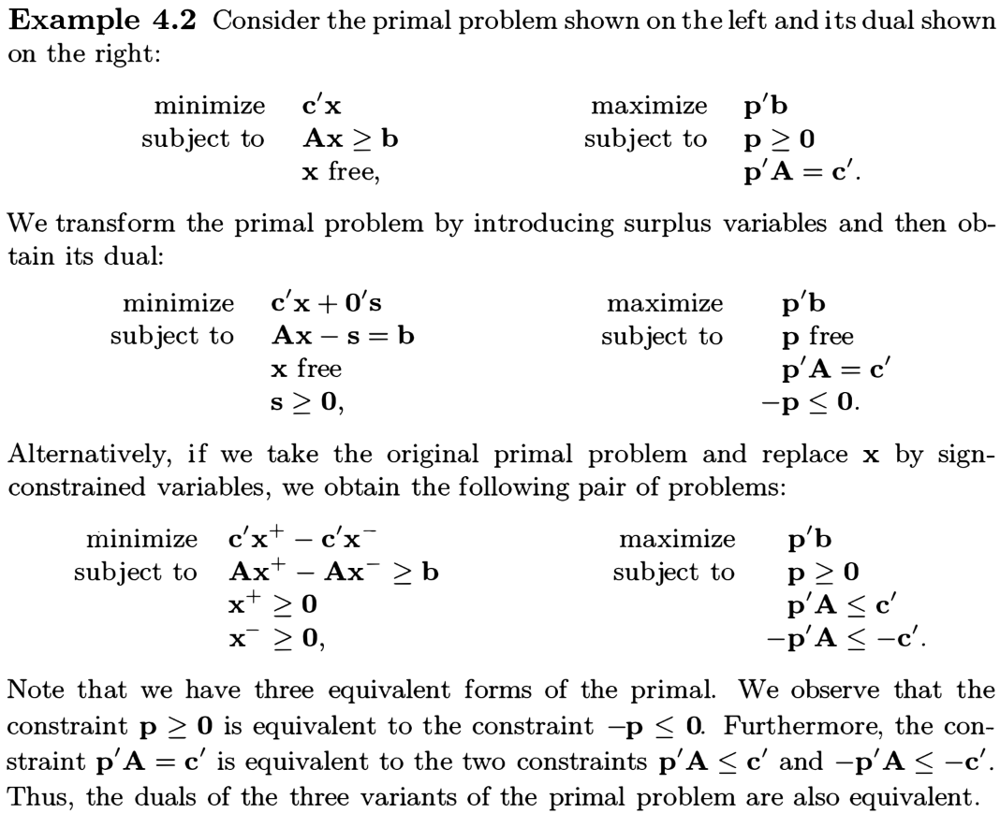
</figure>

<figure style="text-align: left; padding-top: .5em; padding-bottom: .5em;">
  
</figure>

>__Theorem 4.2__ Suppose that we have transformed a linear programming problem $\Pi_1$ to another linear programming problem $\Pi_2$, by a sequence of transformations of the following types:
>
>1. Replace a <u>free variable</u> with the difference of two nonnegative variables.
>2. Replace an inequality constraint by an equality constraint involving a nonnegative <u>slack variable</u>.
>3. If some row of $\mathbf{A}$ in a feasible standard form problem is a <u>linear combination</u> of the other rows, eliminate the corresponding equality constraint.
>
>Then, the duals of $\Pi_1$ and $\Pi_2$ are equivalent, i.e., they are either both infeasible, or they have the same optimal cost.

### 4.3 The duality theorem

A primal and its dual can be stated more compactly, in matrix notation. In <u>standard form</u>,
$$
\begin{alignat*}{5}
\text{minimize} &\quad \mathbf{c}^T\mathbf{x} &\qquad
\text{maximize} &\quad \mathbf{p}^T\mathbf{b} \\
\text{subject to} &\quad \mathbf{Ax}=\mathbf{b} &\qquad
\text{subject to} &\quad \mathbf{p}^T\mathbf{A}\leq\mathbf{c}^T, \\
&\quad \mathbf{x}\geq\mathbf{0},
\end{alignat*}
$$
and in <u>general form</u>,
$$
\begin{alignat*}{5}
\text{minimize} &\quad \mathbf{c}^T\mathbf{x} &\qquad
\text{maximize} &\quad \mathbf{p}^T\mathbf{b} \\
\text{subject to} &\quad \mathbf{Ax}\geq\mathbf{b}, &\qquad
\text{subject to} &\quad \mathbf{p}^T\mathbf{A}=\mathbf{c}^T \\
& &\qquad &\quad \mathbf{p}\geq\mathbf{0}.
\end{alignat*}
$$

For $\mathbf{x}\in\mathbb{R}^n$ and $\mathbf{p}\in\mathbb{R}^m$, we define
$$
u_i \equiv p_i(\mathbf{a}_i^T\mathbf{x}-b_i) \quad\text{and}\quad
v_j \equiv (c_j-\mathbf{p}^T\mathbf{A}_j)x_j.
$$
Since $\sum_i u_i=\mathbf{p}^T(\mathbf{Ax}-\mathbf{b})$ and $\sum_j v_j=(\mathbf{c}^T-\mathbf{p}^T\mathbf{A})\mathbf{x}$​, we have
$$
\sum_i u_i + \sum_j v_j = \mathbf{c}^T\mathbf{x}-\mathbf{p}^T\mathbf{b}.
$$

Let $\mathbf{x}$ and $\mathbf{p}$ be <u>feasible</u> solutions to the primal and the dual, respectively. In <u>standard form</u>, $u_i=0$ and $v_j\geq0$. On the other hand, in <u>general form</u>, $u_i\geq0$ and $v_j=0$. In both cases, $\sum_i u_i+\sum_j v_j\geq 0$.

> __Theorem 4.3 (Weak duality)__ If $\mathbf{x}$ is a <u>feasible</u> solution to the primal problem and $\mathbf{p}$ is a <u>feasible</u> solution to the dual problem, then $\mathbf{p}^T\mathbf{b}\leq\mathbf{c}^T\mathbf{x}$​.

> __Corollary 4.1__ (a) If the optimal cost in the primal is $-\infty$, the dual problem must be <u>infeasible</u>. (b) If the optimal cost in the dual is $\infty$, the primal problem must be <u>infeasible</u>.
>

> __Corollary 4.2__ Let $\mathbf{x}$ and $\mathbf{p}$ be <u>feasible</u> solutions to the primal and the dual, respectively. If $\mathbf{p}^T\mathbf{b}=\mathbf{c}^T\mathbf{x}$, then $\mathbf{x}$ and $\mathbf{p}$ are <u>optimal</u> solutions to the primal and the dual, respectively.
>

> __Theorem 4.4 (Strong duality)__ If a linear programming problem has an optimal solution, then so does its dual, and the respective optimal costs are equal.
>
> _Proof._ (Case 1) Consider the <u>standard form</u> problem: Minimize $\mathbf{c}^T\mathbf{x}$ subject to $\mathbf{Ax}=\mathbf{b}$ and $\mathbf{x}\geq\mathbf{0}$.
>
> 1. Assume that the rows of $\mathbf{A}$ are <u>linearly independent</u> and that there exists an optimal solution.
> 2. Apply the <u>simplex method</u> to this problem. As long as cycling is avoided, the simplex method terminates with an <u>optimal solution</u> $\mathbf{x}^*$ and an <u>optimal basis</u> $\mathbf{B}$.
> 3. When the simplex method terminates, the reduced costs must be nonnegative, i.e., $\mathbf{\bar c}^T=\mathbf{c}^T-\mathbf{c}_B^T\mathbf{B}^{-1}\mathbf{A}\geq\mathbf{0}^T$.
> 4. Define $\mathbf{p}^T\equiv\mathbf{c}_B^T\mathbf{B}^{-1}$​. Then $\mathbf{p}^T\mathbf{A}\leq\mathbf{c}^T$, which shows that $\mathbf{p}$ is a <u>feasible solution</u> to the dual problem: Maximize $\mathbf{p}^T\mathbf{b}$ subject to $\mathbf{p}^T\mathbf{A}\leq\mathbf{c}^T$.
> 5. In addition, $\mathbf{p}^T\mathbf{b}=\mathbf{c}_B^T\mathbf{B}^{-1}\mathbf{b}=\mathbf{c}_B^T\mathbf{x}_B^*=\mathbf{c}^T\mathbf{x}^*$, since $\mathbf{x}^*$​ is a basic feasible solution.
> 6. By Corollary 4.2, $\mathbf{p}$​ is an optimal solution to the dual, and the optimal dual cost is equal to the optimal primal cost.
>
> (Case 2) Consider the <u>general form</u> problem $\Pi_1$ that has an optimal solution. We first transform $\Pi_1$ into an <u>equivalent standard form</u> problem $\Pi_2$ with the same optimal cost, and in which the rows of $\mathbf{A}$ are <u>linearly independent</u>.
>
> 

In a linear programming problem, exactly one of the following three possibilities will occur:

1. (**Finite optimum**) There is an <u>optimal</u> solution.
2. (**Unbounded**) The problem is <u>unbounded</u>; that is, the optimal cost is $-\infty$ (for primal problems) or $\infty$ (for dual problems).
3. (**Infeasible**) The problem is <u>infeasible</u>.

This leads to nine possible combinations for the primal and the dual.

#### Complementary slackness

> __Theorem 4.5 (Complementary slackness)__ Let $\mathbf{x}$ and $\mathbf{p}$ be feasible solutions to the primal and the dual problem, respectively. Then $\mathbf{x}$ and $\mathbf{p}$ are optimal <u>if and only if</u>
> $$
> \begin{align*}
> u_i\equiv p_i(\mathbf{a}_i^T\mathbf{x}-b_i)=0 &\quad\text{for $1\leq i\leq m$}, \\
> v_j\equiv (c_j-\mathbf{p}^T\mathbf{A}_j)x_j=0 &\quad\text{for $1\leq j\leq n$}.
> \end{align*}
> $$
> _Proof._ Recall that, for primal feasible $\mathbf{x}$ and dual feasible $\mathbf{p}$, we have $u_i\geq0$ and $v_j\geq 0$ for all $i$ and $j$. Moreover, $\mathbf{c}^T\mathbf{x}-\mathbf{p}^T\mathbf{b} = \sum_i u_i + \sum_j v_j\geq 0$.
> 
> ($\Rightarrow$) By the strong duality theorem, if $\mathbf{x}$ and $\mathbf{p}$ are optimal, then $\mathbf{c}^T\mathbf{x}=\mathbf{p}^T\mathbf{b}$, which implies that $u_i=v_j=0$ for all $i$ and $j$. ($\Leftarrow$) follows from Corollary 4.2.

##### A. In standard form

We may assume that the rows of $\mathbf{A}$ are <u>linearly independent</u>. (See Example 4.3.)

The first complementary slackness condition is automatically satisfied by every feasible solution $\mathbf{x}$ to a primal problem in <u>standard form</u>, since $\mathbf{Ax}=\mathbf{b}$. Thus it gives <u>no information</u> on $\mathbf{p}$.

However, if $\mathbf{x}$ is a <u>nondegenerate</u> optimal basic feasible solution, then the second complementary slackness conditions determine a <u>unique solution</u> $\mathbf{p}^T=\mathbf{c}_B^T\mathbf{B}^{-1}$ to the dual problem, since $x_j>0$ for all basic variables $j\in B$.

<figure style="text-align: left; padding-top: .5em; padding-bottom: .5em;">
  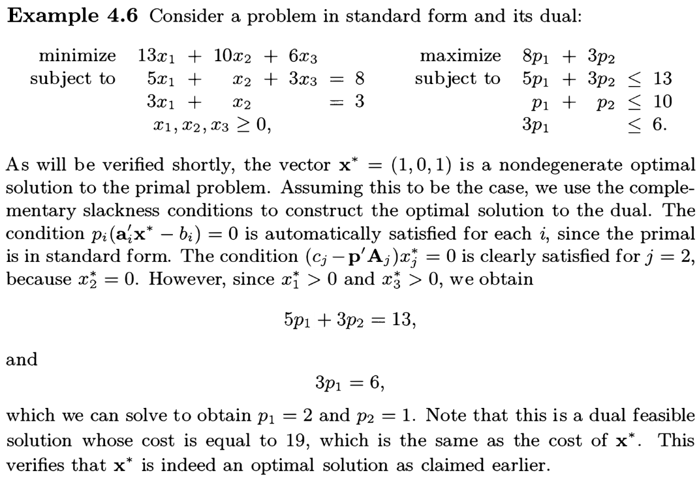
</figure>

##### B. In general form

The first complementary slackness condition implies that $p_i=0$ for all <u>non-active</u> constraints $\mathbf{a}_i^T\mathbf{x}\geq b_i$.

If $\mathbf{x}$ is a <u>nondegenerate</u> optimal basic feasible solution, then there are $n$ <u>linearly independent active</u> constraints so that the rank of $\mathbf{A}$ is $n$. Therefore, a <u>unique solution</u> to the dual problem is determined by $\mathbf{p}^T\mathbf{A}=\mathbf{c}^T$ or $\mathbf{A}^T\mathbf{p}=\mathbf{c}$.

##### C. Degenerate case

On the other hand, if we are given a <u>degenerate</u> optimal basic feasible solution to the primal, then the complementary slackness may be of <u>very little help</u> in determining an optimal solution to the dual problem.

#### A geometric view

Consider the primal problem in <u>general form</u>. Let $I\subseteq\{1,\dotsc,m\}$ such that (1) $|I|=n$ and (2) $\mathbf{a}_i$ for $i\in I$ are linearly independent rows of $\mathbf{A}$. Then the system $\mathbf{a}_i^T\mathbf{x}=b_i$ for $i\in I$ has a <u>unique solution</u> $\mathbf{x}_I$, which is a <u>basic solution</u> to the primal problem. We assume that $\mathbf{x}_I$ is <u>nondegenerate</u>, that is, $\mathbf{a}_i^T\mathbf{x}\neq b_i$ for all $i\notin I$​.

Let $\mathbf{p}\in\mathbb{R}^m$ (not necessarily dual feasible), and consider what is required for $\mathbf{x}_I$ and $\mathbf{p}$ to be optimal solutions. We need:

1. $\mathbf{a}_i^T\mathbf{x}_I>b_i$ for all $i\notin I$ (**primal feasibility**),
2. $p_i=0$ for all $i\notin I$ (**complementary slackness**),
3. $\mathbf{p}^T\mathbf{A}=\mathbf{c}^T$​ or $\mathbf{A}^T\mathbf{p}=\mathbf{c}$ (**dual feasibility**),
4. $\mathbf{p}\geq\mathbf{0}_m$ (**dual feasibility)**.

From (2) and (3), we have a system $\sum_{i\in I}p_i\mathbf{a}_i=\mathbf{c}$, and it has a <u>unique solution</u> $\mathbf{p}_I$, since $\mathbf{a}_i$ for $i\in I$ are $n$ linearly independent. For $\mathbf{p}_I$ to be dual feasible, we also need $\mathbf{p}_I\geq\mathbf{0}_n$​.

Therefore, if (2) is satisfied, $\mathbf{p}_I$ is feasible <u>if and only if</u> $\mathbf{c}$ is a <u>nonnegative linear combination</u> of $\mathbf{a}_i$ for $i\in I$.

### 4.4 Optimal dual variables as marginal costs

Consider the primal problem in <u>standard form</u>. We assume the rows of $\mathbf{A}$ are linearly <u>independent</u> and that there is a <u>nondegenerate</u> basic feasible solution $\mathbf{x}^*$​ which is optimal.

Let $\mathbf{B}$ be the corresponding basis matrix. Then $\mathbf{x}_B^*=\mathbf{B}^{-1}\mathbf{b}>\mathbf{0}_m$ by nondegeneracy. Now replace $\mathbf{b}$ by $\mathbf{b}+\mathbf{d}$ for a <u>sufficiently small</u> perturbation vector $\mathbf{d}\in\mathbb{R}^m$ so that $\mathbf{B}^{-1}(\mathbf{b}+\mathbf{d})>\mathbf{0}_m$.

- The same basis $\mathbf{B}$ leads to a <u>basic feasible solution</u> of the perturbed problem as well.

- Perturbing $\mathbf{b}$ has <u>no effect on the reduced costs</u> $\mathbf{\bar c}=\mathbf{c}^T-\mathbf{c}_B^T\mathbf{B}^{-1}\mathbf{A}$.
- By the optimality of $\mathbf{x}^*$ in the original problem, $\mathbf{\bar c}\geq\mathbf{0}$ and this establishes that the same basis $\mathbf{B}$ is <u>optimal</u> for the perturbed problem as well.
- The <u>optimal cost</u> in the perturbed problem is $\mathbf{c}_B^T\mathbf{B}^{-1}(\mathbf{b}+\mathbf{d}) = \mathbf{p}^T(\mathbf{b}+\mathbf{d})$, where $\mathbf{p}^T=\mathbf{c}_B^T\mathbf{B}^{-1}$ is an optimal solution to the dual problem. Therefore, a small change of $\mathbf{d}$ in $\mathbf{b}$ results in a change of $\mathbf{p}^T\mathbf{d}$ in the optimal cost.

We conclude that each component $p_i$ of the optimal dual vector can be interpreted as the **marginal cost** (or **shadow price**) per unit increase of the $i$-th requirement $b_i$.

### 4.5 Standard form problems and the dual simplex method

We concentrate on the case where the primal problem is in <u>standard form</u>.

Note that the <u>primal optimality</u> condition $\mathbf{\bar c}^T\equiv\mathbf{c}^T-\mathbf{c}_B^T\mathbf{B}^{-1}\mathbf{A}\geq\mathbf{0}^T$ is the same as the <u>dual feasibility</u> condition $\mathbf{p}^T\mathbf{A}\leq\mathbf{c}^T$ by letting $\mathbf{p}^T=\mathbf{c}_B^T\mathbf{B}^{-1}$.

- We can thus think of the <u>simplex method</u> as an algorithm that maintains <u>primal feasibility</u> $\mathbf{x}_B=\mathbf{B}^{-1}\mathbf{b}\geq\mathbf{0}$ and works <u>towards dual feasibility</u> $\mathbf{\bar c}^T\geq\mathbf{0}^T$. A method with this property is generally called a **primal algorithm**.
- An alternative is to start with a <u>dual feasible</u> solution (satisfying $\mathbf{\bar c}^T\geq\mathbf{0}^T$) and work <u>towards primal feasibility</u> $\mathbf{x}_B\geq\mathbf{0}$. A method of this type is called a **dual algorithm**.

#### The dual simplex method

Consider a problem in <u>standard form</u>, under the assumption that the rows of $\mathbf{A}$ are <u>linearly independent</u>. Let $\mathbf{B}$ be a basis matrix, consisting of $m$ linearly independent columns of $\mathbf{A}$​, and consider the (same) corresponding tableau

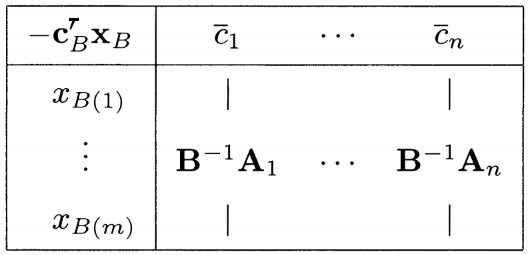

- We <u>do not require</u> $\mathbf{x}_B=\mathbf{B}^{-1}\mathbf{b}\geq\mathbf{0}$, which means that $\mathbf{x}$ is a <u>basic solution</u> ($\mathbf{B}^{-1}\mathbf{A}_{B_i}=\mathbf{e}_i$ for $1\leq i\leq m$ and $x_j=0$ for $j\notin B$; see Theorem 2.4), but not necessarily feasible.

- However, we assume that $\mathbf{\bar c}\geq\mathbf{0}$, equivalently, $\mathbf{p}^T\mathbf{A}\leq\mathbf{c}^T$, and we have a <u>dual feasible</u> solution $\mathbf{p}$.

- The <u>dual cost</u> is $\mathbf{p}^T\mathbf{b}=\mathbf{c}_B^T\mathbf{B}^{-1}\mathbf{b}=\mathbf{c}_B^T\mathbf{x}_B$​, which is the <u>negative of the entry at the upper left corner</u> of the tableau.

- If $\mathbf{x}_B=\mathbf{B}^{-1}\mathbf{b}\geq\mathbf{0}$ happens to hold, we also have a <u>primal feasible</u> solution $\mathbf{x}$​ with <u>the same cost</u>, and optimal solutions to both problems have been found.

- If $x_{B_i}<0$ for some $1\leq i\leq m$, we perform a <u>change of basis</u> as follows.

  - We find some $1\leq l\leq m$ such that $x_{B_l}<0$ and consider the $l$-th row of the tableau, called the **pivot row** $(x_{B_l},v_1,\dotsc,v_n)$, where $v_i$ is the $l$-th component of $\mathbf{B}^{-1}\mathbf{A}_i$.

  - For each $i$ with $v_i<0$ (if exists), let $j$ be an index for which this ratio is smallest, that is, $v_j<0$ and
    $$
    \frac{\bar c_j}{|v_j|} = \min_{i\mid v_i<0} \frac{\bar c_i}{|v_i|}.
    $$
    We call $v_j$ the **pivot element**. Note that $x_j$ must be a nonbasic variable. ($\because$ $\mathbf{B}^{-1}\mathbf{A}_j=\mathbf{e}_i\geq\mathbf{0}$ if $j=B_i$ is a basic variable.)

  - We then perform a <u>change of basis</u>: column $\mathbf{A}_j$ **enters** the basis and column $\mathbf{A}_{B_l}$ **exits**. This change of basis (or pivot) is effected exactly as in the primal simplex method.

<figure style="text-align: left; padding-top: .5em; padding-bottom: .5em;">
  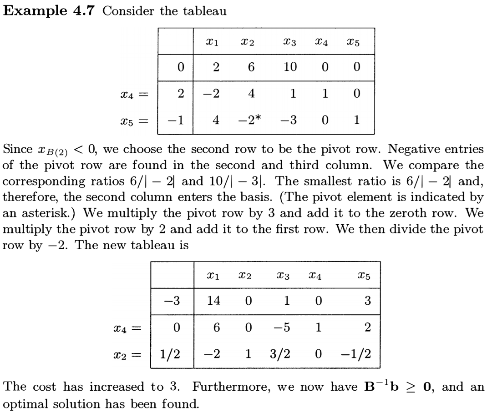
</figure>

> __An iteration of the dual simplex method__
>
> 1. A typical iteration starts with the <u>simplex tableau</u> associated with $\mathbf{B}$ and with $\mathbf{\bar c}\geq\mathbf{0}$.
> 2. Examine $\mathbf{x}_B=\mathbf{B}^{-1}\mathbf{b}$ in the **zeroth column** of the tableau.
>    - If $\mathbf{x}_B\geq\mathbf{0}$, we have an <u>optimal basic feasible solution</u> and the <u>algorithm terminates</u>.
>    - Otherwise, choose an **exiting** index $1\leq l\leq m$ such that $x_{B_l}<0$.
> 3. Consider the $l$-th row (the **pivot row**) of the tableau, $(x_{B_l},v_1,\dotsc,v_n)$.
>    - If $v_i\geq0$ for all $1\leq i\leq n$, then the optimal dual cost is $\infty$ and the <u>algorithm terminates</u>.
> 4. Otherwise, choose an **entering** index $1\leq j\leq n$ such that $\dfrac{\bar c_j}{|v_j|} = \min_{i\mid v_i<0} \dfrac{\bar c_i}{|v_i|}$.
> 5. (<u>Elementary row operations</u>) Add to each row of the tableau a constant multiple of the $l$-th row (the **pivot row**) so that $v_j$ (the **pivot element**) becomes one and all other entries of the pivot column become zero.

The total computational effort per iteration is $O(mn)$.

If the dual simplex method is initialized so that every column of the tableau is lexicographically positive, and if the following lexicographic pivoting rule is used, the method <u>terminates in a finite number of steps</u>.

> __Lexicographic pivoting rule for the dual simplex method__
>
> 1. Choose an **exiting** row $l$ arbitrarily, as long as $x_{B_l}<0$, to be the **pivot row**.
> 2. Determine the **entering** index $j$ as follows.
>    - For each column with $v_i<0$, divide all entries in the column by $|v_i|$, and then choose the <u>lexicographically smallest column</u>.
>    - If there is a <u>tie</u> between several lexicographically smallest columns, choose the one with the <u>smallest index</u>.

#### The geometry of the dual simplex method

<figure style="text-align: left; padding-top: .5em; padding-bottom: .5em;">
  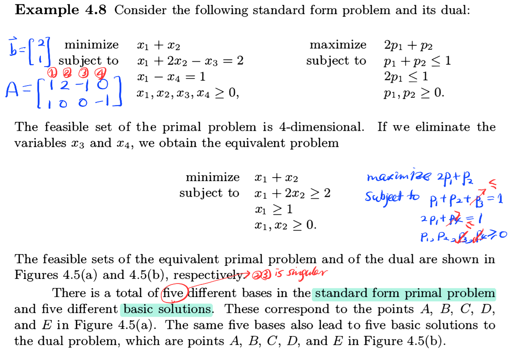
</figure>

<figure style="text-align: left; padding-top: .5em; padding-bottom: .5em;">
  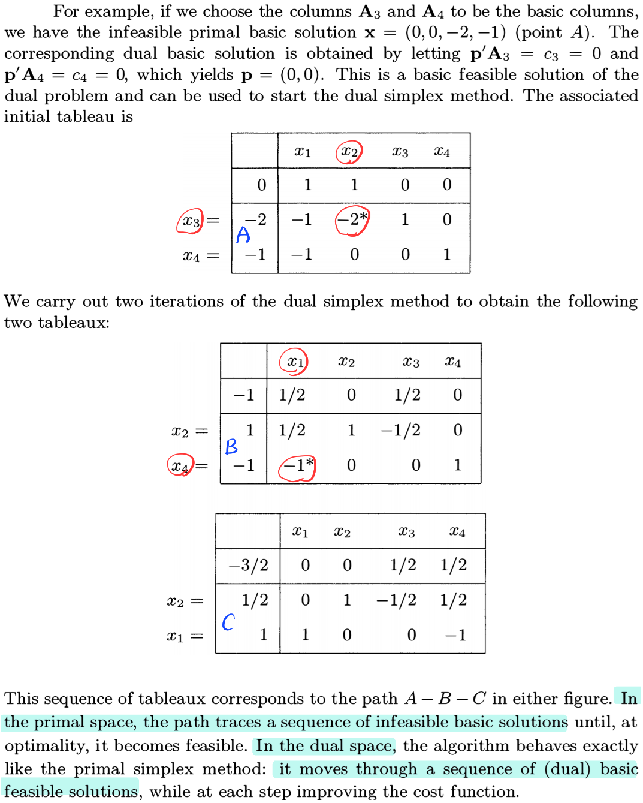
</figure>
It may be tempting to say that the dual simplex method is simply the primal simplex method applied to the dual. Notice that, however, <u>the dual problem is not in standard form</u>.

#### Duality and degeneracy

> __Definition 2.10__ A <u>basic solution</u> $\mathbf{x}\in\mathbb{R}^n$ is said to be **degenerate** if more than $n$ of the constraints are active at $\mathbf{x}$. 

> __Definition 2.11__ Let $P=\{\mathbf{x}\in\mathbb{R}^b\mid\mathbf{Ax}=\mathbf{b},\,\mathbf{x}\geq\mathbf{0}\}$ be a polyhedron in <u>standard form</u> where $\mathbf{A}$ is an $m\times n$ matrix. A <u>basic solution</u> $\mathbf{x}$ is called **degenerate** if <u>more than $n-m$ components of $\mathbf{x}$ are zero</u>.

Any <u>basis matrix</u> $\mathbf{B}$ leads to an associated <u>dual basic solution</u> given by $\mathbf{p}^T=\mathbf{c}_B^T\mathbf{B}^{-1}$. At this basic solution, the dual constraint $\mathbf{p}^T\mathbf{A}_j\leq c_j$ is active <u>if and only if</u> the reduced cost $\bar c_j=c_j-\mathbf{c}_B^T\mathbf{B}^{-1}\mathbf{A}_j=0$. Since $\mathbf{p}\in\mathbb{R}^m$, **dual degeneracy** amounts to having <u>more than $m$​ reduced costs that are zero</u>.

Notice that the reduced costs of $m$ basic variables must be zero. Thus **dual degeneracy** is obtained whenever there exists a <u>nonbasic variable</u> $j\notin B$ such that $\bar c_j=0$.

<figure style="text-align: left; padding-top: .5em; padding-bottom: .5em;">
  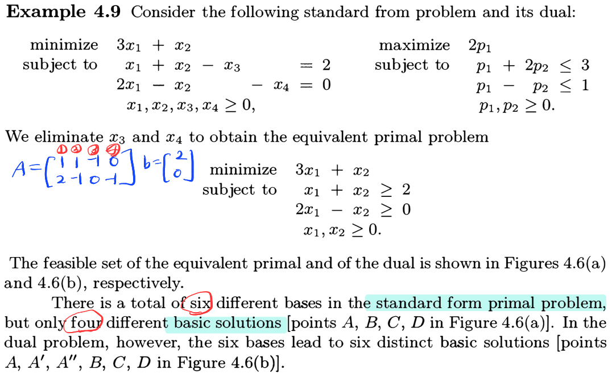
</figure>
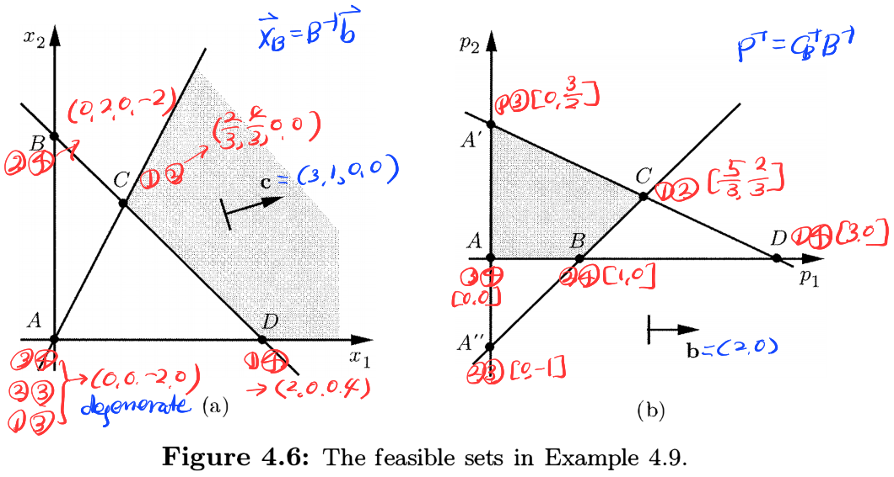

#### Summary for standard form problems

1. Every <u>basis matrix</u> $\mathbf{B}$ determines a <u>basic solution</u> $\mathbf{x}_B=\mathbf{B}^{-1}\mathbf{b}$ (and $x_j=0$ for $j\notin B$) to the primal, but also a corresponding <u>basic solution</u> $\mathbf{p}^T=\mathbf{c}_B^T\mathbf{B}^{-1}$ to the dual.
2. This dual basic solution is <u>feasible</u> if and only if $\mathbf{\bar c}^T=\mathbf{c}^T-\mathbf{p}^T\mathbf{A}\geq\mathbf{0}^T$​.
3. Under this dual basic solution, the reduced cost $\bar c_j=0$ corresponds to the <u>active constraint</u> $\mathbf{p}^T\mathbf{A}_j=c_j$​ in the dual problem.
4. This dual basic solution is <u>degenerate</u> if and only if $\bar c_j=0$ for some nonbasic variable $j\notin B$​.

> __Duality relationships between degeneracy and multiplicity__ [Linear and Integer Optimization, Theory and Practice 3E, p.223]
>
> The following implications (Primal $\Rightarrow$ Dual) hold:
>
> | Primal                                                       | Dual                                                         |
> | ------------------------------------------------------------ | ------------------------------------------------------------ |
> | <u>Multiple</u> optimal solutions                            | All optimal solutions (unique or multiple) are <u>degenerate</u> |
> | <u>Unique and nondegenerate</u> optimal solution             | <u>Unique and nondegenerate</u> optimal solution             |
> | <u>Multiple</u> optimal solutions, <u>at least one nondegenerate</u> | <u>Unique and degenerate</u> optimal solution                |
> | <u>Unique and degenerate</u> optimal solution                | <u>Multiple</u> optimal solutions (degenerate or nondegenerate) |

### 4.6 Farkas' lemma and linear inequalities

Suppose that we wish to determine <u>whether a given system of linear inequalities is infeasible</u>.

> __Theorem 4.6 (Farkas' lemma)__ Let $\mathbf{A}$ be an $m\times n$ matrix and let $\mathbf{b}\in\mathbb{R}^m$. Then, exactly one of the following two alternatives holds:
>
> 1. There exists some $\mathbf{x}\geq\mathbf{0}$ such that $\mathbf{Ax}=\mathbf{b}$.
> 2. There exists some $\mathbf{p}\in\mathbb{R}^m$ such that $\mathbf{p}^T\mathbf{A}\geq\mathbf{0}^T$ and $\mathbf{p}^T\mathbf{b}<0$​.
>
> _Proof._ Suppose (1) holds. If $\mathbf{p}^T\mathbf{A}\geq\mathbf{0}^T$ then $\mathbf{p}^T\mathbf{b}=\mathbf{p}^T(\mathbf{Ax})\geq0$, which is a contradiction to (2).
>
> Suppose (1) <u>does not</u> hold and consider the pair of problems
> $$
> \begin{alignat*}{5}
> \text{minimize} &\quad (-\mathbf{0})^T\mathbf{x} &\qquad
> \text{maximize} &\quad \mathbf{p}^T\mathbf{b} \\
> \text{subject to} &\quad \mathbf{Ax}=\mathbf{b} &\qquad
> \text{subject to} &\quad \mathbf{p}^T\mathbf{A}\leq(-\mathbf{0})^T, \\
> &\quad \mathbf{x}\geq\mathbf{0},
> \end{alignat*}
> $$
> or, equivalently,
> $$
> \begin{alignat*}{5}
> \text{maximize} &\quad \mathbf{0}^T\mathbf{x} &\qquad
> \text{minimize} &\quad (-\mathbf{p})^T\mathbf{b} \\
> \text{subject to} &\quad \mathbf{Ax}=\mathbf{b} &\qquad
> \text{subject to} &\quad (-\mathbf{p})^T\mathbf{A}\geq\mathbf{0}^T, \\
> &\quad \mathbf{x}\geq\mathbf{0}.
> \end{alignat*}
> $$
> The (left) primal is <u>infeasible</u> so that the (right) dual is <u>unbounded</u> (the optimal cost is $-\infty$) since $\mathbf{p}=\mathbf{0}$ is a dual feasible solution. Therefore, there exists some $-\mathbf{p}$ with $(-\mathbf{p})^T\mathbf{b}<0$​​.

#### Geometric illustration of Farkas' lemma

The existence of $\mathbf{x}\geq\mathbf{0}$ satisfying $\mathbf{Ax}=\mathbf{b}$ is the same as that $\mathbf{b}$ is expressed as a <u>nonnegative linear combination</u> of the columns of $\mathbf{A}$. Otherwise, we expect intuitively that we can find $\mathbf{p}$ and an associated hyperplane $\{\mathbf{z}\mid\mathbf{p}^T\mathbf{z}=0\}$ that separates $\mathbf{b}$ from the set $\{\mathbf{Ax}\mid\mathbf{x}\geq\mathbf{0}\}$. (See Section 4.7.)

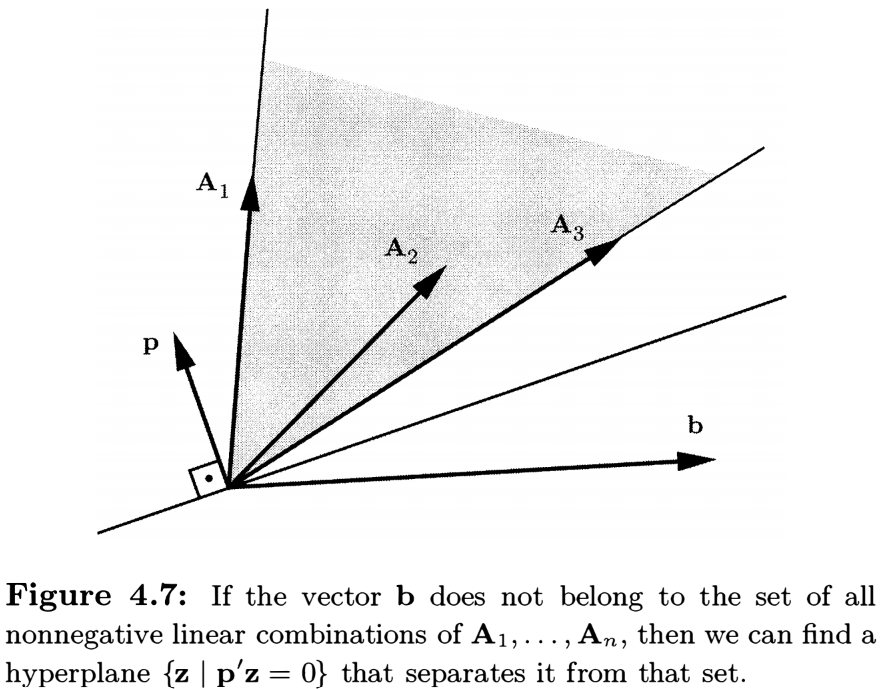

> __Corollary 4.3__ Let $\mathbf{A}_1,\dotsc,\mathbf{A}_n,\mathbf{b}\in\mathbb{R}^m$. Suppose that any $\mathbf{p}\in\mathbb{R}^m$ that satisfies $\mathbf{p}^T\mathbf{A}_i\geq0$ for all $1\leq i\leq n$ must also satisfy $\mathbf{p}^T\mathbf{b}\geq0$. Then $\mathbf{b}$ can be expressed as a <u>nonnegative linear combination</u> of $\mathbf{A}_1,\dotsc,\mathbf{A}_n$​.

> __Theorem 4.7__ Suppose that the system of linear inequalities $\mathbf{Ax}\leq\mathbf{b}$ has <u>at least one solution</u>, and let $d$ be some scalar. Then, the following are <u>equivalent</u>:
>
> 1. Every <u>feasible</u> solution to the system $\mathbf{Ax}\leq\mathbf{b}$ satisfies $\mathbf{c}^T\mathbf{x}\leq d$.
> 2. There exists some $\mathbf{p}\geq\mathbf{0}$ such that $\mathbf{p}^T\mathbf{A}=\mathbf{c}^T$ and $\mathbf{p}^T\mathbf{b}\leq d$​.
>
> _Proof._ Consider the pair of problems
> $$
> \begin{alignat*}{5}
> \text{minimize} &\quad (-\mathbf{c})^T\mathbf{x} &\qquad
> \text{maximize} &\quad \mathbf{p}^T\mathbf{b} \\
> \text{subject to} &\quad \mathbf{Ax}\leq\mathbf{b} &\qquad
> \text{subject to} &\quad \mathbf{p}^T\mathbf{A}=(-\mathbf{c})^T \\
> &\quad &\qquad &\quad \mathbf{p}\leq\mathbf{0}.
> \end{alignat*}
> $$
> ($\Rightarrow$) The primal is feasible by assumption, and it has an optimal solution $\mathbf{x}^*$ by (1) with the optimal cost $(-\mathbf{c})^T\mathbf{x}^*\geq -d$. By the strong duality, the dual problem also has an optimal solution $\mathbf{p}^*\leq\mathbf{0}$ and $(\mathbf{p}^*)^T\mathbf{b}=(-\mathbf{c})^T\mathbf{x}^*\geq-d$. Then $-\mathbf{p}^*\geq\mathbf{0}$ is what we want to find.
>
> ($\Leftarrow$) By (2) we have a dual feasible solution $-\mathbf{p}\leq\mathbf{0}$ and it satisfies that $-d\leq(-\mathbf{p})^T\mathbf{b}\leq-\mathbf{c}^T\mathbf{x}$ for all primal feasible solutions $\mathbf{x}$​ by the weak duality.

#### Clark's theorem

> __Alternative Farkas' lemma__ Exactly one of the following two alternatives holds:
>
> 1. There exists some $\mathbf{x}\geq\mathbf{0}$ such that $\mathbf{Ax}\leq\mathbf{b}$.
> 2. There exists some $\mathbf{p}\in\mathbb{R}^m$ such that $\mathbf{p}^T\mathbf{A}\geq\mathbf{0}^T$, $\mathbf{p}^T\mathbf{b}<0$, and $\mathbf{p}\geq\mathbf{0}$.
>
> _Proof._ Notice that $\mathbf{Ax}\leq\mathbf{b}$, $\mathbf{x}\geq\mathbf{0}$ is feasible if and only if $\mathbf{Ax}+\mathbf{s}=\mathbf{b}$, $\mathbf{x}\geq\mathbf{0}$, $\mathbf{s}\geq\mathbf{0}$.

>__Clark's theorem__ [Clark, 1961] Consider the following pair of the primal and the dual problems:
>$$
>\begin{alignat*}{5}
>\text{minimize} &\quad \mathbf{c}^T\mathbf{x} &\qquad
>\text{maximize} &\quad \mathbf{p}^T\mathbf{b} \\
>\text{subject to} &\quad \mathbf{Ax}\geq\mathbf{b} &\qquad
>\text{subject to} &\quad \mathbf{p}\geq\mathbf{0} \\
>&\quad \mathbf{x}\geq\mathbf{0}, &\qquad
>&\quad \mathbf{p}^T\mathbf{A}\leq\mathbf{c}^T.
>\end{alignat*}
>$$
>Unless both problems are infeasible, at least one of them must have an unbounded feasible set.
>
>_Proof._ Suppose that the primal and the dual are feasible. Alternative Farkas' lemma tells us exact one of the following system holds.
>
>1. There exists some $\mathbf{p}\geq\mathbf{0}$ such that $\mathbf{A}^T\mathbf{p}\leq-\mathbf{1}_n$.
>2. There exists some $\mathbf{x}\in\mathbb{R}^n$ such that $\mathbf{x}^T\mathbf{A}^T\geq\mathbf{0}^T$, $\mathbf{x}^T(-\mathbf{1}_n)<0$, and $\mathbf{x}\geq\mathbf{0}$.
>
>If (2) holds, let $\mathbf{x}^*\neq\mathbf{0}$ be a feasible solution to (2) and let $\mathbf{x}$ be a feasible solution to the primal problem. Then $\mathbf{A}(\mathbf{x}+\lambda\mathbf{x}^*)=\mathbf{Ax}+\lambda\mathbf{A}\mathbf{x}^*\geq\mathbf{b}$ for all $\lambda>0$​. It follows that the primal has an unbounded feasible set.
>
>On the other hand, if (1) holds, let $\mathbf{p}^*\neq\mathbf{0}$ be a feasible solution to (1) and let $\mathbf{p}$ be a feasible solution to the dual problem. Then $(\mathbf{p}+\lambda\mathbf{p}^*)^T\mathbf{A}=\mathbf{p}^T\mathbf{A}+\lambda(\mathbf{p}^*)^T\mathbf{A}\leq\mathbf{c}^T-\lambda\mathbf{1}_n^T\leq\mathbf{c}^T$ for all $\lambda>0$. It follows that the dual has an unbounded feasible set.

### 4.7 From separating hyperplanes to duality

> __Theorem 4.11 (Separating hyperplane theorem)__ Let $S\neq\varnothing\subseteq\mathbb{R}^n$ be closed convex and let $\mathbf{x}^*\notin S$. Then there exists some $\mathbf{c}\in\mathbb{R}^n$ such that $\mathbf{c}^T\mathbf{x}^*<\mathbf{c}^T\mathbf{x}$ for all $\mathbf{x}\in S$.

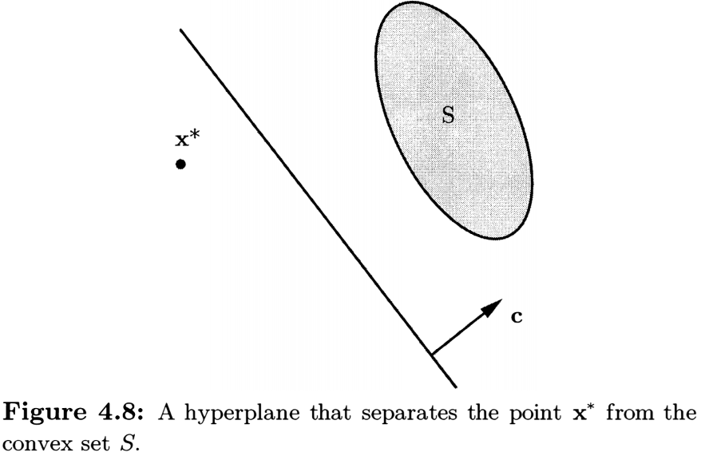

#### Separating hyperplane theorem implies Farkas' lemma

> _Proof._ Suppose (1) <u>does not</u> hold. Then $\mathbf{b}\notin S=\{\mathbf{Ax}\mid\mathbf{x}\geq\mathbf{0}\}\subseteq\mathbb{R}^m$ and $S$ is a nonempty closed convex set. By the separating hyperplane theorem, there exists $\mathbf{p}\in\mathbb{R}^m$ such that $\mathbf{p}^T\mathbf{b}<\mathbf{p}^T\mathbf{y}$ for all $\mathbf{y}\in S$​.
>
> - Since $\mathbf{A0}=\mathbf{0}\in S$, we have $\mathbf{p}^T\mathbf{b}<\mathbf{p}^T\mathbf{0}=0$​.
> - Since each column $\mathbf{A}_i=\mathbf{A}\mathbf{e}_i\in S$, we have $\lambda\mathbf{A}_i\in S$ so that $\mathbf{p}^T\mathbf{b}<\lambda\mathbf{p}^T\mathbf{A}_i$ $\Rightarrow$ $\frac{1}{\lambda}\mathbf{p}^T\mathbf{b}<\mathbf{p}^T\mathbf{A}_i$ for all $\lambda>0$.  It follows that $\mathbf{p}^T\mathbf{A}_i\geq 0$ for all $1\leq i\leq m$ by taking the limit as $\lambda\to\infty$.

#### Farkas' lemma implies the strong duality theorem

We only provide the proof for the linear problem in <u>general form</u>:
$$
\begin{alignat*}{5}
\text{minimize} &\quad \mathbf{c}^T\mathbf{x} &\qquad
\text{maximize} &\quad \mathbf{p}^T\mathbf{b} \\
\text{subject to} &\quad \mathbf{Ax}\geq\mathbf{b}, &\qquad
\text{subject to} &\quad \mathbf{p}^T\mathbf{A}=\mathbf{c}^T \\
& &\qquad &\quad \mathbf{p}\geq\mathbf{0}.
\end{alignat*}
$$
Suppose that the primal has an optimal solution $\mathbf{x}^*$. We will show that the dual problem also has a feasible solution with the same cost. Then Theorem 4.4 (Strong duality) follows from Corollary 4.2.

> _Proof._ Let $I=\{i\mid \mathbf{a}_i^T\mathbf{x}^*=b_i\}$ be the set of indices of the constraints that are active at $\mathbf{x}^*$​. We claim that any $\mathbf{d}$ that satisfies $\mathbf{a}_i^T\mathbf{d}\geq0$ for all $i\in I$, must also satisfy $\mathbf{c}^T\mathbf{d}\geq0$.
>
> ($\because$) If $i\in I$, then $\mathbf{a}_i^T\mathbf{d}\geq0$ $\Rightarrow$ $\mathbf{a}_i^T(\mathbf{x}^*+\epsilon\mathbf{d})\geq\mathbf{a}_i^T\mathbf{x}^*=b_i$ for $\epsilon>0$. On the other hand, if $i\notin I$, then $\mathbf{a}_i^T\mathbf{x}^*>b_i$ $\Rightarrow$ $\mathbf{a}_i^T(\mathbf{x}^*+\epsilon\mathbf{d})>b_i$ for sufficiently small $\epsilon>0$. Therefore, $\mathbf{x}^*+\epsilon\mathbf{d}$ is a feasible solution for sufficiently small $\epsilon>0$. The optimality of $\mathbf{x}^*$ implies that $\mathbf{c}^T(\mathbf{x}^*+\epsilon\mathbf{d})\geq\mathbf{c}^T\mathbf{x}^*$ and thus $\mathbf{c}^T\mathbf{d}\geq0$​.
>
> By Farkas' lemma (Corollary 4.3), $\mathbf{c}$ can be expressed as a <u>nonnegative</u> linear combination of $\mathbf{a}_i$ for $i\in I$, so that $\mathbf{c}=\sum_{i\in I}p_i\mathbf{a}_i$ for $p_i\geq0$. For $i\notin I$, let $p_i=0$. Then $\mathbf{p}$ is a dual feasible solution, i.e., $\mathbf{p}\geq\mathbf{0}$ and $\mathbf{p}^T\mathbf{A}=\mathbf{c}^T$. Moreover,
> $$
> \mathbf{p}^T\mathbf{b} = \sum_{i\in I}p_ib_i = \sum_{i\in I}p_i(\mathbf{a}_i^T\mathbf{x}^*) = \mathbf{c}^T\mathbf{x}^*,
> $$
> which shows that the dual cost of $\mathbf{p}$ is the same as the optimal primal cost.

### 4.8 Cones and extreme rays

#### Cones

> __Definition 4.1__ A set $C\subset\mathbb{R}^n$ is a **cone** if $\lambda\mathbf{x}\in C$ for all $\lambda\geq 0$ and for all $\mathbf{x}\in C$​.

Notice that every <u>nonempty cone</u> contains $\mathbf{0}$. ($\because$ If $\mathbf{x}\in C$, we must have $\mathbf{0}=0\mathbf{x}\in C$​.) A polyhedron of the form $\{\mathbf{x}\in\mathbb{R}^n\mid\mathbf{Ax}\geq\mathbf{0}\}$​​ is a <u>nonempty cone</u> and is called a **polyhedral cone**.

Note that any $\mathbf{x}\neq\mathbf{0}$ in a polyhedral cone $C$ is not an extreme point so that the only possible extreme point is $\mathbf{0}$. If $\mathbf{0}$ is indeed an extreme point, we say that the cone is **pointed**.

> __Theorem 4.12__ Let $C=\{\mathbf{x}\in\mathbb{R}^n\mid\mathbf{Ax}\geq\mathbf{0}\}$ be a polyhedral cone. Then the following are equivalent:
>
> 1. $\mathbf{0}$ is an <u>extreme point</u> of $C$.
> 2. $C$ <u>does not</u> contain a line. (See Theorem 2.6.)
> 3. $\mathbf{A}$ has $n$​ <u>linearly independent</u> rows (or $\mathbf{0}$ is a basic feasible solution.)

#### Rays and recession cones

Let $P=\{\mathbf{x}\in\mathbb{R}^n\mid\mathbf{Ax}\geq\mathbf{b}\}$ be a <u>nonempty</u> polyhedron. The **recession cone** at $\mathbf{y}\in P$ is defined by
$$
\{\mathbf{d}\in\mathbb{R}^n\mid\mathbf{y}+\lambda\mathbf{d}\in P\text{ for all $\lambda\geq0$}\},
$$
and it is the same as the <u>polyhedral cone</u> $\{\mathbf{d}\in\mathbb{R}^n\mid\mathbf{Ad}\geq\mathbf{0}\}$. ($\supseteq$) is trivial. ($\subseteq$) If $\mathbf{a}_i^T\mathbf{d}<0$ for some $i$, then $\mathbf{a}_i^T(\mathbf{y}+\lambda\mathbf{d})\to-\infty$ as $\lambda\to\infty$. This shows that the recession cone is independent of the choice of $\mathbf{y}$. The nonzero elements of the recession cone are called the **rays** of $P$.

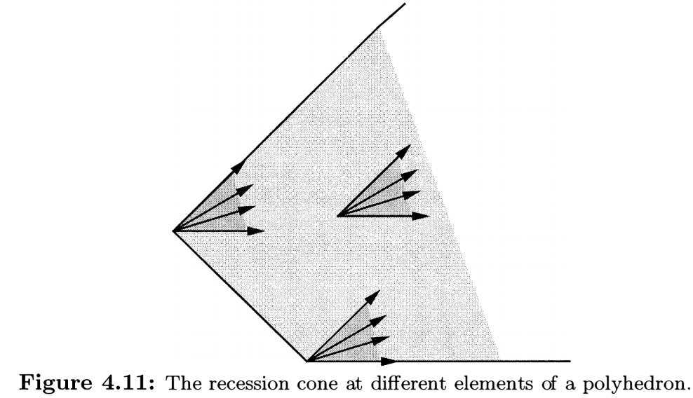

For the case of a <u>nonempty</u> polyhedron $P=\{\mathbf{x}\in\mathbb{R}^n\mid\mathbf{Ax}=\mathbf{b},\,\mathbf{x}\geq\mathbf{0}\}$ in <u>standard form</u>, the recession cone is $\{\mathbf{d}\in\mathbb{R}^n\mid\mathbf{Ad}=\mathbf{0},\,\mathbf{d}\geq\mathbf{0}\}$.

#### Extreme rays

> __Definition 4.2__ (a) A $\mathbf{x}\neq\mathbf{0}$ of a <u>polyhedral cone</u> $C\subseteq\mathbb{R}^n$ is called an **extreme ray** if there are $n-1$ linearly independent constraints that are active at $\mathbf{x}$​.
>
> (b) An <u>extreme ray of the recession cone</u> associated with a nonempty polyhedron $P$ is also called an **extreme ray** of $P$.

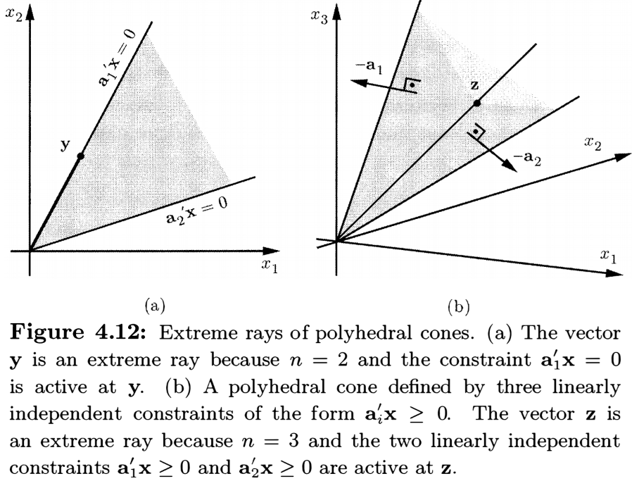

#### Characterization of unbounded linear programming problems

> __Theorem 4.13__ Consider the problem of minimizing $\mathbf{c}^T\mathbf{x}$ over a <u>pointed</u> polyhedral cone $C=\{\mathbf{x}\in\mathbb{R}^n\mid\mathbf{Ax}\geq\mathbf{0}\}$. The optimal cost is equal to $-\infty$ <u>if and only if</u> some extreme ray $\mathbf{d}\in C$ satisfies $\mathbf{c}^T\mathbf{d}<0$​.
>
> _Proof._ ($\Leftarrow$) is trivial. ($\Rightarrow$) By assumption, there exists some $\mathbf{x}\in C$ whose cost $\mathbf{c}^T\mathbf{x}=-1$. In particular, the polyhedron $P=\{\mathbf{x}\in\mathbb{R}^n\mid\mathbf{Ax}\geq\mathbf{0},\,\mathbf{c}^T\mathbf{x}=-1\}$ is nonempty. Since $C$ is pointed, the rows of $\mathbf{A}$ span $\mathbb{R}^n$ so that $P$ has at least one extreme point, say $\mathbf{d}$. At $\mathbf{d}$, we have $n$ linearly independent active constraints, which means that $n-1$ linearly independent constraints from $\mathbf{Ax}\geq\mathbf{0}$ must be active. It follows that $\mathbf{d}$ is an extreme ray of $C$.

> __Theorem 4.14__ Consider the problem of minimizing $\mathbf{c}^T\mathbf{x}$ over $P=\{\mathbf{x}\in\mathbb{R}^n\mid\mathbf{Ax}\geq\mathbf{b}\}$ in general form. Assume that $P$ has at least one extreme point. The optimal cost is equal to $-\infty$ <u>if and only if</u> some extreme ray $\mathbf{d}\in P$ satisfies $\mathbf{c}^T\mathbf{d}<0$​.
>
> _Proof._ ($\Leftarrow$) is trivial. ($\Rightarrow$​) Consider the two problems:
> $$
> \begin{alignat*}{5}
> \text{maximize} &\quad \mathbf{p}^T\mathbf{b} &\qquad
> \text{maximize} &\quad \mathbf{p}^T\mathbf{0} \\
> \text{subject to} &\quad \mathbf{p}^T\mathbf{A}=\mathbf{c}^T &\qquad
> \text{subject to} &\quad \mathbf{p}^T\mathbf{A}=\mathbf{c}^T \\
> &\quad \mathbf{p}\geq\mathbf{0}, &\qquad
> &\quad \mathbf{p}\geq\mathbf{0}.
> \end{alignat*}
> $$
> If the primal problem is unbounded, the (left) dual problem is infeasible. Then the right problem is also infeasible so that the associated primal problem of minimizing $\mathbf{c}^T\mathbf{x}$ subject to $\mathbf{Ax}\geq\mathbf{0}$ is unbounded, since $\mathbf{0}$ is a feasible solution.
>
> Since the primal feasible set has at least one extreme point by assumption, the rows of $\mathbf{A}$ span $\mathbb{R}^n$. It follows that the recession cone $\{\mathbf{x}\mid\mathbf{Ax}\geq\mathbf{0}\}$ is pointed and, by Theorem 4.13, there exists an extreme ray $\mathbf{d}$ of the recession cone satisfying $\mathbf{c}^T\mathbf{d}<0$. This is an extreme ray of the feasible set.

#### The unboundedness criterion in the simplex method

If we have a standard form problem in which the optimal cost is $-\infty$, the simplex method provides us at termination with an <u>extreme ray</u>, the $j$-th basic direction $\mathbf{d}\geq\mathbf{0}$ satisfying $\mathbf{Ad}=\mathbf{0}$, since $\mathbf{d}_B=-\mathbf{B}^{-1}\mathbf{A}_j$, $d_j=1$, and $d_i=0$ for other nonbasic indices $i\neq j$.
