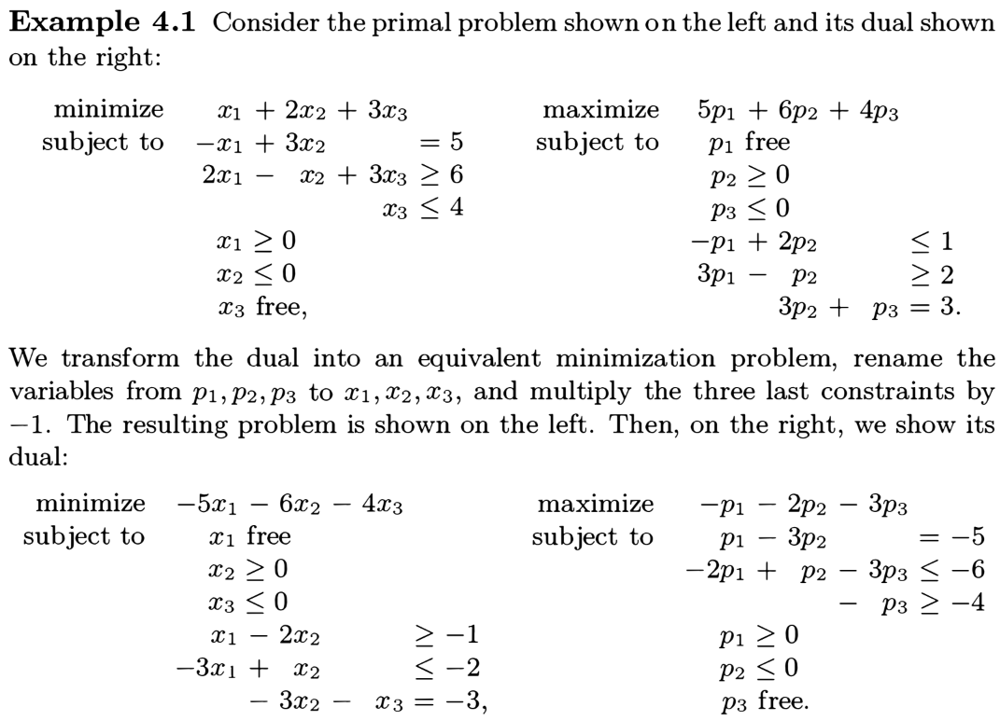
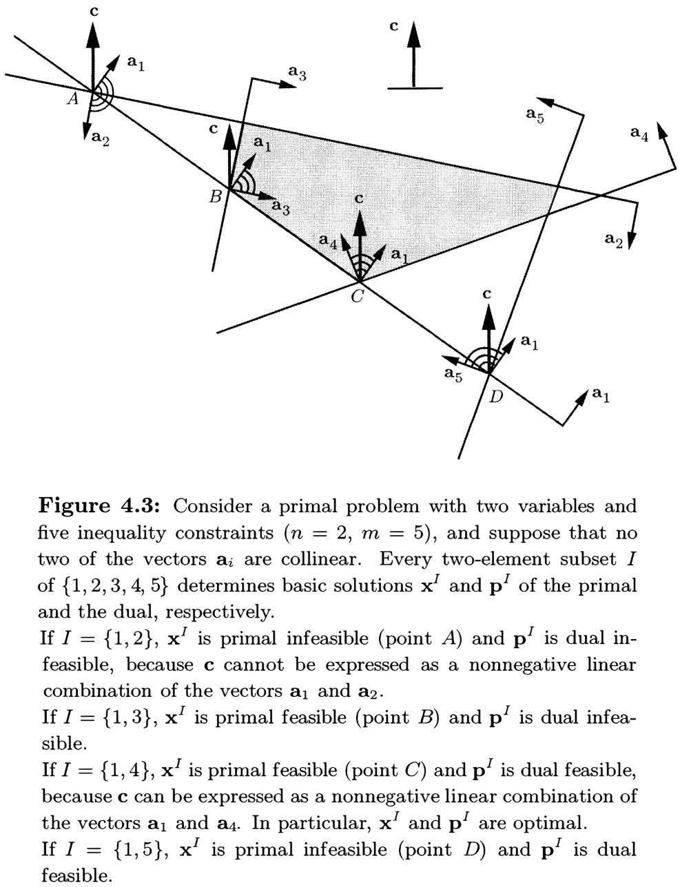

# Introduction to Linear Optimization

**Dimitris Bertsimas** (https://en.wikipedia.org/wiki/Dimitris_Bertsimas)

- Professor in the Sloan School of Management, MIT

**John N. Tsitsiklis** (https://en.wikipedia.org/wiki/John_Tsitsiklis)

- Professor of Electrical Engineering with the Department of EECS, MIT

**References**

- **Introduction to Linear Optimization** (1997)
  - Athena Scientific, Belmont, Massachusetts, ISBN 1-886529-19-1

## Chapter 4. Duality Theory

### 4.1 Motivation

We associate a **price** variable (or <u>Lagrange multiplier</u>) with each constraint and start searching for prices under which the presence or absence of the constraints <u>does not affect</u> the optimal cost.

#### A. The primal problem in the standard form

Consider the <u>standard form</u> problem
$$
\begin{align*}
\text{minimize} & \quad\mathbf{c}^T\mathbf{x} \\
\text{subject to} & \quad\mathbf{Ax}=\mathbf{b} \\
& \quad\mathbf{x}\geq\mathbf{0},
\end{align*}
$$
which we call the **primal** problem, and assume that an optimal solution $\mathbf{x}^*$ exists.

We introduce a <u>relaxed problem</u> with a price vector $\mathbf{p}\in\mathbb{R}^m$​
$$
\begin{align*}
\text{minimize} & \quad\mathbf{c}^T\mathbf{x}+\mathbf{p}^T(\mathbf{b}-\mathbf{Ax}) \\
\text{subject to} & \quad\mathbf{x}\geq\mathbf{0}.
\end{align*}
$$
Then the optimal cost $g(\mathbf{p})$ of the relaxed problem for each $\mathbf{p}$ is
$$
g(\mathbf{p}) = \min_{\mathbf{x}\geq\mathbf{0}}\bigl[\mathbf{c}^T\mathbf{x}+\mathbf{p}^T(\mathbf{b}-\mathbf{Ax})\bigr] \leq \mathbf{c}^T\mathbf{x}^*+\mathbf{p}^T(\mathbf{b}-\mathbf{A}\mathbf{x}^*) = \mathbf{c}^T\mathbf{x}^*,
$$
since $\mathbf{x}^*$ is feasible, so that $g(\mathbf{p})$ is a <u>lower bound</u> for the optimal cost $\mathbf{c}^T\mathbf{x}^*$. Moreover,
$$
g(\mathbf{p}) = \mathbf{p}^T\mathbf{b}+\min_{\mathbf{x}\geq\mathbf{0}}(\mathbf{c}^T-\mathbf{p}^T\mathbf{A})\mathbf{x} = \mathbf{p}^T\mathbf{b}+\begin{cases} 0, &\text{if $\mathbf{c}^T-\mathbf{p}^T\mathbf{A}\geq\mathbf{0}^T$} \\ -\infty, &\text{otherwise}. \end{cases}
$$
The **dual** problem searches for the <u>tightest possible lower bound</u>, $\max_{\mathbf{p}\in\mathbb{R}^m}g(\mathbf{p})$.
$$
\begin{align*}
\text{maximize} & \quad\mathbf{p}^T\mathbf{b} \\
\text{subject to} & \quad\mathbf{p}^T\mathbf{A}\leq\mathbf{c}^T.
\end{align*}
$$

#### B. The primal problem in the general form

Consider the primal in the <u>general form</u>
$$
\begin{align*}
\text{minimize} & \quad\mathbf{c}^T\mathbf{x} \\
\text{subject to} & \quad\mathbf{Ax}\geq\mathbf{b},
\end{align*}
$$
which is equivalent to the problem in the <u>standard form</u>
$$
\begin{align*}
\text{minimize} & \quad\mathbf{c}^T\mathbf{x} \\
\text{subject to} & \quad\mathbf{Ax}-\mathbf{s}=\mathbf{b} \\
& \quad\mathbf{s}\geq\mathbf{0}.
\end{align*}
$$
Since the equality $\mathbf{Ax}-\mathbf{s}=\mathbf{b}$ can be written in the form $\bigl[\mathbf{A}\:\vert\:-\mathbf{I}_m\bigr] \begin{bmatrix}\mathbf{x}\\ \mathbf{s}\end{bmatrix}=\mathbf{b}$, the dual constraints become $\mathbf{p}^T \bigl[\mathbf{A}\:\vert\:-\mathbf{I}_m\bigr] \leq \bigl[\mathbf{c}^T\:\vert\:\mathbf{0}_m^T\bigr]$ or $\mathbf{p}^T\mathbf{A}\leq\mathbf{c}^T,\,\mathbf{p}\geq\mathbf{0}$. However, in this case $\mathbf{s}\geq\mathbf{0}$ but $\mathbf{x}$ is free.

Actually, the optimal cost for the relaxed problem is
$$
\begin{align*}
g(\mathbf{p}) &= \min_{\mathbf{x}\in\mathbb{R}^n,\mathbf{s}\geq\mathbf{0}}\bigl[\mathbf{c}^T\mathbf{x}+\mathbf{p}^T(\mathbf{b}-\mathbf{Ax}+\mathbf{s})\bigr]
= \mathbf{p}^T\mathbf{b} + \min_{\mathbf{x}\in\mathbb{R}^n}(\mathbf{c}^T-\mathbf{p}^T\mathbf{A})\mathbf{x} + \min_{\mathbf{s}\geq\mathbf{0}}\mathbf{p}^T\mathbf{s} \\
&= \mathbf{p}^T\mathbf{b} + \begin{cases} 0, &\text{if $\mathbf{c}^T-\mathbf{p}^T\mathbf{A}=\mathbf{0}^T$} \\ -\infty, &\text{otherwise} \end{cases} + \begin{cases} 0, &\text{if $\mathbf{p}\geq\mathbf{0}$} \\ -\infty, &\text{otherwise}. \end{cases}
\end{align*}
$$
Therefore, the dual problem is
$$
\begin{align*}
\text{maximize} & \quad\mathbf{p}^T\mathbf{b} \\
\text{subject to} & \quad\mathbf{p}^T\mathbf{A}=\mathbf{c}^T \\
& \quad\mathbf{p}\geq\mathbf{0}.
\end{align*}
$$
Notice that if the equality is replaced to $\mathbf{Ax}+\mathbf{s}=\mathbf{b}$ (in the case of $\mathbf{Ax}\leq\mathbf{b}$), then the dual constraints should be replaced to $\mathbf{p}\leq\mathbf{0}$.

### 4.2 The dual problem

Given a **primal** problem with the structure shown on the left, its **dual** is defined to be the maximization problem shown on the right:
$$
\begin{alignat*}{6}
\text{minimize} &\quad \mathbf{c}^T\mathbf{x} &\qquad
\text{maximize} &\quad \mathbf{p}^T\mathbf{b} \\
\text{subject to} &\quad \mathbf{a}_i^T\mathbf{x} \geq b_i, &\qquad
\text{subject to} &\quad p_i\geq 0, &\qquad i\in M_1, \\
&\quad \mathbf{a}_i^T\mathbf{x} \leq b_i, &\qquad
&\quad p_i \leq 0, &\qquad i\in M_2, \\
&\quad \mathbf{a}_i^T\mathbf{x} = b_i, &\qquad
&\quad p_i \text{ free}, &\qquad i\in M_3, \\
&\quad x_j \geq 0, &\qquad
&\quad \mathbf{p}^T\mathbf{A}_j \leq c_j &\qquad j\in N_1, \\
&\quad x_j \leq 0, &\qquad
&\quad \mathbf{p}^T\mathbf{A}_j \geq c_j &\qquad j\in N_2, \\
&\quad x_j \text{ free}, &\qquad
&\quad \mathbf{p}^T\mathbf{A}_j = c_j &\qquad j\in N_3. \\
\end{alignat*}
$$

<figure style="text-align: left; padding-top: .5em; padding-bottom: .5em;">
  
</figure>

> __Theorem 4.1__ If we transform the dual into an equivalent minimization problem and then form its dual, we obtain a problem <u>equivalent</u> to the original problem. In other words, "<u>the dual of the dual is the primal</u>."

<figure style="text-align: left; padding-top: .5em; padding-bottom: .5em;">
  
</figure>

<figure style="text-align: left; padding-top: .5em; padding-bottom: .5em;">
  
</figure>

>__Theorem 4.2__ Suppose that we have transformed a linear programming problem $\Pi_1$ to another linear programming problem $\Pi_2$, by a sequence of transformations of the following types:
>
>1. Replace a free variable with the difference of two nonnegative variables.
>2. Replace an inequality constraint by an equality constraint involving a nonnegative slack variable.
>3. If some row of $\mathbf{A}$ in a feasible standard form problem is a linear combination of the other rows, eliminate the corresponding equality constraint.
>
>Then, the duals of $\Pi_1$ and $\Pi_2$ are equivalent, i.e., they are either both infeasible, or they have the same optimal cost.

### 4.3 The duality theorem

A primal and its dual can be stated more compactly, in matrix notation. In <u>standard form</u>,
$$
\begin{alignat*}{5}
\text{minimize} &\quad \mathbf{c}^T\mathbf{x} &\qquad
\text{maximize} &\quad \mathbf{p}^T\mathbf{b} \\
\text{subject to} &\quad \mathbf{Ax}=\mathbf{b} &\qquad
\text{subject to} &\quad \mathbf{p}^T\mathbf{A}\leq\mathbf{c}^T, \\
&\quad \mathbf{x}\geq\mathbf{0},
\end{alignat*}
$$
and in <u>general form</u>,
$$
\begin{alignat*}{5}
\text{minimize} &\quad \mathbf{c}^T\mathbf{x} &\qquad
\text{maximize} &\quad \mathbf{p}^T\mathbf{b} \\
\text{subject to} &\quad \mathbf{Ax}\geq\mathbf{b}, &\qquad
\text{subject to} &\quad \mathbf{p}^T\mathbf{A}=\mathbf{c}^T \\
& &\qquad &\quad \mathbf{p}\geq\mathbf{0}.
\end{alignat*}
$$

For $\mathbf{x}\in\mathbb{R}^n$ and $\mathbf{p}\in\mathbb{R}^m$, we define
$$
u_i \equiv p_i(\mathbf{a}_i^T\mathbf{x}-b_i) \quad\text{and}\quad
v_j \equiv (c_j-\mathbf{p}^T\mathbf{A}_j)x_j.
$$
Since $\sum_i u_i=\mathbf{p}^T(\mathbf{Ax}-\mathbf{b})$ and $\sum_j v_j=(\mathbf{c}^T-\mathbf{p}^T\mathbf{A})\mathbf{x}$​, we have
$$
\sum_i u_i + \sum_j v_j = \mathbf{c}^T\mathbf{x}-\mathbf{p}^T\mathbf{b}.
$$

> __Theorem 4.3 (Weak duality)__ If $\mathbf{x}$ is a <u>feasible</u> solution to the primal problem and $\mathbf{p}$ is a <u>feasible</u> solution to the dual problem, then $\mathbf{p}^T\mathbf{b}\leq\mathbf{c}^T\mathbf{x}$​.
>
> _Proof._ If $\mathbf{x}$ and $\mathbf{p}$ are primal and dual feasible, respectively, then $u_i=0$ and $v_j\geq0$ in <u>standard form</u>, and $u_i\geq0$ and $v_j=0$ in <u>general form</u>. In both cases, we have $\sum_i u_i+\sum_j v_j=\mathbf{c}^T\mathbf{x}-\mathbf{p}^T\mathbf{b}\geq 0$.
>

> __Corollary 4.1__ (a) If the optimal cost in the primal is $-\infty$, then the dual problem must be <u>infeasible</u>. (b) If the optimal cost in the dual is $\infty$, then the primal problem must be <u>infeasible</u>.
>

> __Corollary 4.2__ Let $\mathbf{x}$ and $\mathbf{p}$ be feasible solutions to the primal and the dual, respectively. If $\mathbf{p}^T\mathbf{b}=\mathbf{c}^T\mathbf{x}$, then $\mathbf{x}$ and $\mathbf{p}$ are optimal solutions to the primal and the dual, respectively.
>

> __Theorem 4.4 (Strong duality)__ If a linear programming problem has an optimal solution, then so does its dual, and the respective optimal costs are equal.
>
> _Proof._ (Case 1) Consider the <u>standard form</u> problem: Minimize $\mathbf{c}^T\mathbf{x}$ subject to $\mathbf{Ax}=\mathbf{b}$ and $\mathbf{x}\geq\mathbf{0}$.
>
> 1. Assume that the rows of $\mathbf{A}$ are linearly independent and that there exists an optimal solution.
> 2. Apply the simplex method to this problem. As long as cycling is avoided, the simplex method terminates with an <u>optimal solution</u> $\mathbf{x}^*$ and an <u>optimal basis</u> $\mathbf{B}$.
> 3. When the simplex method terminates, the reduced costs must be nonnegative, i.e., $\mathbf{\bar c}^T=\mathbf{c}^T-\mathbf{c}_B^T\mathbf{B}^{-1}\mathbf{A}\geq\mathbf{0}^T$.
> 4. Define $\mathbf{p}^T\equiv\mathbf{c}_B^T\mathbf{B}^{-1}$​. Then $\mathbf{p}^T\mathbf{A}\leq\mathbf{c}^T$, which shows that $\mathbf{p}$ is a <u>feasible solution</u> to the dual problem: Maximize $\mathbf{p}^T\mathbf{b}$ subject to $\mathbf{p}^T\mathbf{A}\leq\mathbf{c}^T$.
> 5. In addition, $\mathbf{p}^T\mathbf{b}=\mathbf{c}_B^T\mathbf{B}^{-1}\mathbf{b}=\mathbf{c}_B^T\mathbf{x}_B=\mathbf{c}^T\mathbf{x}^*$, since $\mathbf{x}^*$​ is a basic feasible solution.
> 6. By Corollary 4.2, $\mathbf{p}$​ is an optimal solution to the dual, and the optimal dual cost is equal to the optimal primal cost.
>
> (Case 2) Consider the <u>general form</u> problem $\Pi_1$ that has an optimal solution. We first transform $\Pi_1$ into an <u>equivalent standard form</u> problem $\Pi_2$ with the same optimal cost, and in which the rows of $\mathbf{A}$ are linearly independent.
>
> 

In a linear programming problem, exactly one of the following three possibilities will occur:

1. (**Finite optimum**) There is an optimal solution.
2. (**Unbounded**) The problem is unbounded; that is, the optimal cost is $-\infty$ (for primal problems) or $\infty$ (for dual problems).
3. (**Infeasible**) The problem is infeasible.

This leads to nine possible combinations for the primal and the dual.

#### Complementary slackness

> __Theorem 4.5 (Complementary slackness)__ Let $\mathbf{x}$ and $\mathbf{p}$ be feasible solutions to the primal and the dual problem, respectively. Then $\mathbf{x}$ and $\mathbf{p}$ are optimal <u>if and only if</u>
> $$
> \begin{align*}
> u_i\equiv p_i(\mathbf{a}_i^T\mathbf{x}-b_i)=0 &\quad\text{for $1\leq i\leq m$}, \\
> v_j\equiv (c_j-\mathbf{p}^T\mathbf{A}_j)x_j=0 &\quad\text{for $1\leq j\leq n$}.
> \end{align*}
> $$
> _Proof._ Recall that, for primal feasible $\mathbf{x}$ and dual feasible $\mathbf{p}$, we have $u_i\geq0$ and $v_j\geq 0$ for all $i$ and $j$. Moreover, $\mathbf{c}^T\mathbf{x}-\mathbf{p}^T\mathbf{b} = \sum_i u_i + \sum_j v_j$.
> 
> ($\Rightarrow$) By the strong duality theorem, if $\mathbf{x}$ and $\mathbf{p}$ are optimal, then $\mathbf{c}^T\mathbf{x}=\mathbf{p}^T\mathbf{b}$, which implies that $u_i=v_j=0$ for all $i$ and $j$. ($\Leftarrow$) follows from Corollary 4.2.

##### A. In standard form

We may assume that the rows of $\mathbf{A}$ are linearly independent. (See Example 4.3.)

The first complementary slackness condition is automatically satisfied by every feasible solution $\mathbf{x}$ to a primal problem in <u>standard form</u>, since $\mathbf{Ax}=\mathbf{b}$. Thus it gives no information on $\mathbf{p}$.

However, if $\mathbf{x}$ is a <u>nondegenerate</u> optimal basic feasible solution, then the second complementary slackness conditions determine a <u>unique solution</u> to the dual problem, $\mathbf{p}^T=\mathbf{c}_B^T\mathbf{B}^{-1}$, since $x_j>0$ so that $c_j-\mathbf{p}^T\mathbf{A}_j=0$ for all basic variables $j\in B$.

<figure style="text-align: left; padding-top: .5em; padding-bottom: .5em;">
  
</figure>

##### B. In general form

The first complementary slackness condition implies that $p_i=0$ for all non-active constraints $\mathbf{a}_i^T\mathbf{x}\geq b_i$.

If $\mathbf{x}$ is a <u>nondegenerate</u> optimal basic feasible solution, then there are $n$ linearly independent active constraints so that the rank of $\mathbf{A}$ is $n$. Therefore, a <u>unique solution</u> to the dual problem is determined by $\mathbf{p}^T\mathbf{A}=\mathbf{c}^T$.

##### C. Degenerate case

On the other hand, if we are given a <u>degenerate</u> optimal basic feasible solution to the primal, then the complementary slackness may be of <u>very little help</u> in determining an optimal solution to the dual problem.

#### A geometric view

Consider the primal problem in <u>general form</u>. Let $I\subseteq\{1,\dotsc,m\}$ such that (1) $|I|=n$ and (2) $\mathbf{a}_i$ for $i\in I$ are linearly independent. Then the system $\mathbf{a}_i^T\mathbf{x}=b_i$ for $i\in I$ has a <u>unique solution</u> $\mathbf{x}_I$​, which is a basic solution to the primal problem. We assume that $\mathbf{x}_I$ is nondegenerate, that is, $\mathbf{a}_i^T\mathbf{x}\neq b_i$ for all $i\notin I$​.

Let $\mathbf{p}\in\mathbb{R}^m$ be a dual vector (not necessarily dual feasible), and consider what is required for $\mathbf{x}_I$ and $\mathbf{p}$ to be optimal solutions. We need:

1. $\mathbf{a}_i^T\mathbf{x}_I\geq b_i$ for all $i$ (**primal feasibility**),
2. $p_i=0$ for all $i\notin I$ (**complementary slackness**),
3. $\mathbf{p}^T\mathbf{A}=\mathbf{c}^T$​ or $\mathbf{A}^T\mathbf{p}=\mathbf{c}$ (**dual feasibility**),
4. $\mathbf{p}\geq\mathbf{0}$ (**dual feasibility)**.

From (2) and (3), we have $\sum_{i\in I}p_i\mathbf{a_i}=\mathbf{c}$. It has a <u>unique solution</u> $\mathbf{p}_I$, since $\mathbf{a}_i$ for $i\in I$ are linearly independent. For $\mathbf{p}_I$ to be dual feasible, we also need $\mathbf{p}_I\geq\mathbf{0}_n$​.

Therefore, if (2) is satisfied, $\mathbf{p}_I$ is feasible <u>if and only if</u> $\mathbf{c}$ is a <u>nonnegative linear combination</u> of $\mathbf{a}_i$ for $i\in I$.

If $\mathbf{x}^*$ is a degenerate basic solution to the primal, there can be several subsets $I$ such that $\mathbf{x}_I=\mathbf{x}^*$. Using different choices for $I$, and by solving the system $\sum_{i\in I}p_i\mathbf{a}_i=\mathbf{c}$, we may obtain several dual basic solutions $\mathbf{p}_I$. It may then well be the case that some of them are dual feasible and some are not.

Still, if $\mathbf{p}_I$ is dual feasible, i.e., $p_i\geq 0$ for all $i$) and if $\mathbf{x}^*$ is primal feasible, then they are both optimal, because we have been enforcing complementary slackness and Theorem 4.5 applies.

### 4.4 Optimal dual variables as marginal costs

Consider the primal problem in <u>standard form</u>. We assume the rows of $\mathbf{A}$ are linearly <u>independent</u> and that there is a <u>nondegenerate</u> basic feasible solution $\mathbf{x}^*$​ which is optimal.

Let $\mathbf{B}$ be the corresponding basis matrix. Then $\mathbf{x}_B^*=\mathbf{B}^{-1}\mathbf{b}>\mathbf{0}_m$ by nondegeneracy. Now replace $\mathbf{b}$ by $\mathbf{b}+\mathbf{d}$ for a sufficiently small perturbation vector $\mathbf{d}\in\mathbb{R}^m$ so that $\mathbf{B}^{-1}(\mathbf{b}+\mathbf{d})>\mathbf{0}_m$. This implies that the same basis $\mathbf{B}$ leads to a basic feasible solution of the perturbed problem as well.

Perturbing $\mathbf{b}$ has no effect on the reduced costs $\mathbf{\bar c}=\mathbf{c}^T-\mathbf{c}_B^T\mathbf{B}^{-1}\mathbf{A}$ associated with the basis $\mathbf{B}$. By the optimality of $\mathbf{x}^*$ in the original problem, $\mathbf{\bar c}\geq\mathbf{0}$ and this establishes that the same basis is optimal for the perturbed problem as well. Thus, the optimal cost in the perturbed problem is
$$
\mathbf{c}_B^T\mathbf{B}^{-1}(\mathbf{b}+\mathbf{d}) = \mathbf{p}^T(\mathbf{b}+\mathbf{d}),
$$
where $\mathbf{p}^T=\mathbf{c}_B^T\mathbf{B}^{-1}$ is an optimal solution to the dual problem. Therefore, a small change of $\mathbf{d}$ in $\mathbf{b}$ results in a change of $\mathbf{p}^T\mathbf{d}$ in the optimal cost.

We conclude that each component $p_i$ of the optimal dual vector can be interpreted as the **marginal cost** (or **shadow price**) per unit increase of the $i$-th requirement $b_i$.

